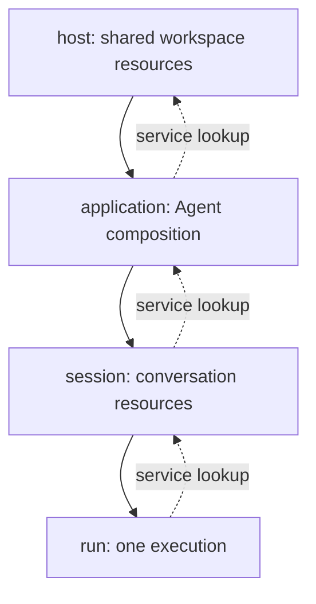

# Plugin composition and lifecycle

**English** | [简体中文](../../zh-CN/architecture/plugins.md)

This explanation describes May's implemented plugin host: how services become
available, how nested scopes own resources, and how Hooks participate in execution.
Use the [plugin guide](../guides/plugins.md) to declare and load a plugin.

## Definitions

A Plugin is a configured lifecycle unit. A Service is a named, typed capability
with a version, scope and implementation. A Hook is a declared execution point
with a validator and explicit transformation or observation semantics. A
PluginHost validates the composition and owns startup, changes and cleanup.

## Composition and services

Plugins declare stable ids, semantic versions, configuration schemas, provided
services, required and optional services, required hooks and setup. Each service
has a stable id, version, capabilities and host, application, session or run scope.
Required services and hooks must exist before any setup executes. Duplicate
providers, incompatible versions, unmet capabilities, cycles and dependencies
on shorter-lived services fail validation. Optional dependencies are absent
explicitly. No implicit provider selection is performed.

Services become available only after their provider finishes initialization.
Consumers use declared dependencies. A plugin may own several services and hooks,
including a runtime and its associated Context. External shared instances retain
their caller's ownership unless an explicit disposer transfers it.

## Lifecycle and scopes

A Run plugin can use its Session's services and the Application's Model. An
Application plugin cannot depend on a Run service because that instance is
created later and ends sooner. Each child scope creates its own instances.

Host, application, session and run form nested scopes. Setup follows dependency
order; cleanup follows reverse dependency order. Every listener, timer, connection
and background operation has an owner. Setup failure stops further setup and
cleans already initialized plugins. Cleanup completes for remaining resources
and aggregates errors. Closing rejects new work and is idempotent.

Configuration, add, remove and replacement are serialized. The prospective graph
is validated before active providers are removed. Work using affected resources
must finish or be cancelled and drained before a change. New operations cannot
race a pending change. Failed replacement leaves the affected scope unavailable;
durable history remains readable. Session state has explicit schema versions and
migrations and must be verified before resumed execution.

## State and replacement

Plugin state declares a numeric state version, an initial value and optional
schema and migration. Reads return copies. Accepted `set()` and `update()` calls
validate their values and await the configured writer before reporting success.
Application and Session state is saved under `may.plugins`; Run state is temporary.
Unknown saved plugin records remain available in history.

During replacement, active work completes its writes before the host pauses new
state calls and drains accepted writes. Cleanup precedes replacement initialization.
Replacement setup can update restored state. Incompatible plugin or state versions
require explicit migration. Runtime replacement also saves and restores the
runtime descriptor and versioned state through Session's runtime lifecycle methods.

## Hooks

The supported catalog covers application creation/closure, input submission,
Run startup/settlement, Step boundaries, Context views and compaction, model
requests/streams/responses/failures, tool arguments/execution/progress/results,
approval observations and recovery. A runtime advertises the hooks it supports.
Unsupported required hooks fail composition validation.

Transformations run in explicit order, then plugin configuration order, then
registration order. Inputs and replacements are cloned and validated. Observers
cannot mutate execution data. Every awaited handler has a timeout and cancellation
signal. Control errors fail the operation; explicitly isolated observation errors
must be reported. Handler cleanup removes its registration.

Tool argument transformations precede final validation and authorization. No
mutation occurs between authorization and execution. Hooks cannot broaden host
permissions. Raw tool outcomes remain available separately from transformed
model-facing content. Durable messages, state changes, compaction and continuation
requests use acknowledged Session writes. Cancellation, Run budgets and host yield
take precedence over continuation requests. Resume never replays historical tools.

## Built-in plugin composition

Shared service tokens and ordered contribution registries belong to
`@may/plugin-services`. Runtime, Context, Model, permissions, Skills, goals,
history-memory, delegation, MCP, observability, delivery, channels, Agent adapters,
coordination and Web/API are supplied by reusable factories under
`packages/plugins/`. Product configuration and combinations belong to the
applications' `src/plugins/` directories. Packages do not import applications.

Tool and instruction contributions have stable identities and cleanup functions.
Model and Context wrappers apply to each new runtime in explicit order, plugin
declaration order and registration order. Context configuration may depend on the
wrapped Model. Factories declare their service and Hook dependencies. Product
defaults are selected when the configured combination has no provider for that
service. Replacements receive creation notifications for the current Application.

Workspace-wide MCP and tracing resources are shared across Session changes and
closed by their owning host. Adapter registries create instances on demand,
validate capabilities and remove released instances. Coordination registries
release completed runtimes. Channel plugins own their receive loops; delivery
records preserve acknowledged, pending and unknown outcomes. HTTP listener
shutdown closes connections and waits for requests before disposing product
routes. Cleanup continues after errors and reports all cleanup failures.

## Integration and verification

AgentDefinition selects plugins; AgentApplication opens their scopes and integrates
Session state. The default May loop is offered by a runtime plugin through a
replaceable runtime factory. MaybeCode and MaybeClaw accept product-specific plugin
selection without changing direct callers.

`packages/plugin/test/` covers composition validation, scopes, Hook ordering,
cleanup, changes and state migration. Application tests cover integration with
Session state and runtime replacement. From the repository root, run
`pnpm --filter @may/plugin test` and `pnpm --filter @may/application test` for
those checks. `pnpm test:package:plugin` installs the packed dependency chain in
an external consumer and exercises public exports. These checks use local
resources; external provider integration has separate evidence.
