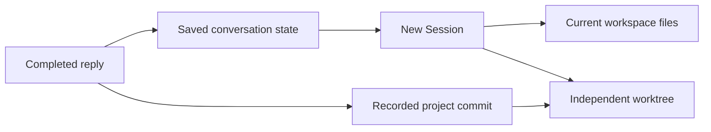

# Session branching and Git checkpoints

**English** | [简体中文](../../zh-CN/architecture/session-forks-and-checkpoints.md)

Status: implemented. Public component APIs are described in the
[Session documentation](../../../packages/session/README.md),
[Runtime and Session architecture](runtime-session.md), and
[Git workspace guide](../guides/git-workspaces.md).

This explanation is for host and UI authors implementing branching, file-version
display and worktree ownership. To use the feature, follow the Git workspace guide.

## Goals and concepts

A Session fork creates an independent Session from a selected historical position,
preserves its origin, and accepts further requests. A file checkpoint associates a
reply with a project Git commit. A worktree supplies an independent directory and branch.

Session ancestry and Git branches are recorded separately. Multiple Sessions may use
one workspace and share its current files and Git branch. Independent worktrees have
their own directories and current branches. Interfaces distinguish current workspace
state from versions recorded with historical replies.

General Session branching supports any host. Git initialization, automatic commits,
and worktree management apply to applications with project file workspaces.
`Session.fork()`, `AgentApplication.open({ fork })`, and `AgentWorkspace.forkSession()`
provide reusable branching. `ProjectGitWorkspace` supplies Node.js file version management.
MaybeCode integrates both components with its TUI, WebUI, and client protocol.

Both modes restore saved conversation state. The current-workspace mode uses the
current files; the independent worktree starts from the recorded commit.

## Product behavior

- Project workspaces use Git version management by default; an explicit setting can
  disable automatic commits.
- Existing repositories are reused; workspaces without Git are initialized automatically.
- Each completed round of modifications creates a project commit as its file checkpoint.
- Session forks support the current workspace and a newly created worktree.
- The default worktree root is `.may/worktrees/` under the user's home directory.
- TUI `/fork` opens a tree history selector.
- WebUI and client applications expose a fork action after each complete Agent reply.
- Every UI persistently displays the workspace's current Git branch.
- Checkpoints and diffs use project Git history, with versions linked to conversation history.

## Complete replies and fork positions

The main user-facing history unit is one complete request execution. Its model calls,
tools, verification, and fixes belong to that execution. A selectable position becomes
available after tools and approval waits settle and execution and resumable state persist.

Intermediate assistant messages do not automatically become fork positions. Incomplete
streams, unknown tool outcomes, and failed state persistence display their limitations
and restrict forks. Missing historical runtime state cannot be replaced with state from
another position.

The new Session has its own identity and records its source Session, source history
position, workspace, and Git version. Restored state includes the selected model-visible
Context, provider `modelState`, runtime state, Skills, and application state declared
forkable. Historical tools are never executed again. Approval records and grants,
pending steering input, and running processes are excluded from the new Session.
Already delivered steering input remains model-visible history.
`forkStateKeys`, `forkPluginIds`, and `forkStateTransform` explicitly select and migrate
application/plugin state. Skills are included; MaybeCode remaps workspace-relative
Skill paths and preserves its declared Context notes and history memory.
MaybeCode records the provider, model, adapter, profile and reasoning effort at
each model configuration change. Forking a recorded position selects its original
profile and options before restoring Context. A changed profile configuration that
resolves to a different provider, model or adapter rejects with a diagnostic.
Hosts supplying a direct Model and identity must supply the same identity;
models without identity metadata use the Runtime's compatibility handling.

`run.settled` marks the durable successful fork position after Runtime and application
state have been saved. `session.created.fork` records the source Session, sequence and
Run. `session.fork.ready` marks complete fork persistence. Incomplete copied history
is unavailable for resume. Session storage must implement read-only `inspect()`.

## Fork interaction

### TUI

`/fork` opens a tree containing user requests, complete replies, and existing Session
forks. It initially selects the latest available complete reply and supports keyboard
navigation, search, expanded previews, and cancellation. Each selectable position shows
its time, request and reply summaries, and associated file-version availability.

After confirming a position, the user selects the current workspace or a new worktree.
Successful creation enters the new Session with an empty composer. The selector makes
no model summarization request.

### WebUI and client applications

The action after a complete reply selects that history position directly and opens
workspace-mode selection. These surfaces use the same host operations and availability
rules as the TUI.

## Workspace modes

### Current workspace

The fork uses conversation state at the selected position and retains current files and
the current Git branch. The interface explains the conversation origin and current file
state; the Agent is informed that subsequent file changes may exist.

For example, `a.ts` contains A after round two and B after round four. A current-workspace
fork from round two has conversation history through round two and reads B from `a.ts`.

Restoring historical files is a separate operation with an explicit target, affected
scope, and restoration preview. Diff views expose file restoration, require confirmation,
and send the host's one-use preview identifier when applying the reviewed operation.

### New worktree

The default uses the selected reply's commit to create an independent directory
and Git branch. In the example, a worktree fork from round two contains A in `a.ts`.

The default layout is `.may/worktrees/<projectId>/<worktreeId>`, with a configurable root.
Names and paths avoid collisions. The source repository and commit must be available;
missing versions produce an error instead of silently selecting another file version.

MaybeCode rebuilds workspace-bound tools and Skills for the selected directory. Configured
MCP connections are owned per workspace: relative stdio working directories follow the
worktree, external absolute directories remain configured, and host roots use the active
workspace. Returning to a workspace reuses its connections. Closing the host releases
all workspace connections and the shared tracing processor.

Session and worktree creation have inspectable completion states. Partial failure retains
explicit ownership records and diagnostics and cannot appear as an available new Session.

## Default Git management and initial version

An existing repository is resolved for the current workspace, including project
subdirectories and Git worktrees. Projects without Git are initialized and receive an
initial commit. Existing uncommitted changes are saved as an initial
checkpoint, establishing a comparison baseline for subsequent replies.

The Agent begins modifying files after workspace preparation and initial version saving
succeed. Missing Git, missing identity, failed initial commits, and incompatible repository
states report their causes while preserving files and readable conversation history.
With automatic commits disabled, interfaces display that mode and use only existing,
available versions as file checkpoints.

`apps.maybecode.git` accepts `false` or an object containing `autoCommit`, `readOnly`,
`dataRoot`, `worktreesRoot`, and `excludedPaths`. The default enables automatic Git
management. Read-only mode allows questions without initializing repositories,
committing files, or creating Git checkpoint state. Commit authorization is supplied
by the host through `authorizeCommit`; project-required approval is evaluated before
staging. A rejected authorization preserves files and the Git index.

Commit scope follows project Git ownership and ignore rules without expanding outside
the repository. Eligible staged changes are included when their working content matches
the index. Divergent staged/working content fails explicitly. Ignore rules and configured
exclusions remain effective; the Git workspace guide lists automatic credential-path
exclusions. Staged excluded files require explicit correction. Submodules and changed
nested repositories are rejected for automatic commits. Active merge, rebase,
cherry-pick, revert and sequencer operations are rejected. Detached HEAD uses its actual
commit, and the UI displays its state. Repository root and common Git directory are
validated before operations; identity changes produce an error requiring reopening.

## Per-round commits and checkpoints

The request lifecycle uses these rules:

- A normally completed round creates at most one automatic commit, after edits,
  verification, and fixes finish.
- A round without file changes associates its reply with the current commit.
- Commit messages are English descriptions of the final modifications.
- Persist `sessionId`, `runId`, history position, workspace, starting and ending commits,
  historical branch, and commit outcome independently of commit-message parsing.
- Commit failure records a checkpoint-saving failure, retains changes, and accurately
  displays the remaining recovery capabilities.
- Failed, yielded and cancelled requests retain uncommitted changes and record their
  status. A later successful request starts from the existing Git commit and includes
  the preserved eligible changes in its resulting version.

A Goal completed after host verification saves its final checkpoint even when
its final Run yielded for scheduling. The Goal Run finalization callback holds
the workspace lease through verification, then saves the final file version and
a `run.settled` record with `hostCompleted: true`. Rejected verification,
verification errors and cancellation retain changes and release the lease.

One complete request can contain several main Runs and child tasks. The host holds one
Git lease across that complete request and records its `runId` and `runIds` together.
Intermediate main replies cannot create worktree branches until the complete request's
file version is available.

Automatic commits capture workspace changes during the round. Concurrent human edits
may be included, so diffs cannot label all changes as Agent-authored. Manual commits and
branch switches preserve their actual version provenance.

Reopening a Session reconciles current repository state with recorded versions. If a
commit succeeded but checkpoint metadata persistence failed, a durable Git operation
intent recovers the existing commit without creating another commit. Intent recovery
validates the prepared tree and parent identity; ambiguous changed history requires
inspection. The checkpoint-to-Session history mapping remains independent of commit text.

## Diff presentation

Provide per-round changes, changes across the Session, and comparisons between a historical
version and the current workspace. Per-round comparisons use starting and ending versions;
uncommitted changes are explicitly presented as current workspace changes.

The TUI initially shows file counts and additions/deletions. A keyboard-driven file list
opens colored unified diffs with scrolling, search, and change navigation. WebUI and
clients provide equivalent file lists and diff views. Binary files and files without
textual diffs display their type and change status.

File restoration displays a preview and revalidates current file state. Changes made after
the preview stop restoration and report a conflict. Historical contents are read and
restored through the file-writing component.

`ProjectGitWorkspace.previewRestore()` captures file fingerprints and exact target
contents. `restore(preview, options)` checks all reviewed fingerprints, restores regular
files with ordinary writes/deletions, and saves its checkpoint under one exclusive
workspace lock. Symbolic-link parents and Git metadata paths are rejected. Binary
contents are retained. Filesystem failure reports the partial operation; it cannot be
presented as successful restoration.

TUI `/changes [run <run-id>|session|workspace|commit <commit>]` chooses the comparison.
The TUI file viewer uses `Enter` for patches, `/` for search, `]` for the next change,
`R` for restoration preview and `Y` for confirmation.

## Branch display and state updates

The TUI displays the branch in its bottom status bar; WebUI and clients use the conversation
header or a fixed workspace-information area. Detached HEAD displays its state and short
commit hash. Repositories without a commit display initialization state; read failures
display an error state.

Sessions using the same workspace display its current branch consistently. Initialization,
automatic commits, Session switches, worktree creation, and external Git changes refresh
state. Historical replies retain their recorded branch and commit even when the current
branch name changes.

Hosts expose structured workspace Git state, initial-version outcomes, commit outcomes,
checkpoint availability, fork outcomes, and worktree lifecycle information to all UIs.

## Worktree management and retention

Worktree records include source repository, source Session, fork position, starting commit,
directory, branch, associated Sessions, and current state. Management supports listing,
opening, and explicit deletion.

Closing a Session retains its worktree. Session deletion and worktree deletion are separate
operations. Before removing a directory, inspect associated Sessions, running processes,
uncommitted changes, and unmerged commits and explain content requiring preservation.
May automatically manages only worktrees it registered.

Checkpoints persist with project Git history across application shutdown. Valid checkpoints
require retained Git reachability, particularly after worktree-branch deletion or user
history changes. Deleting a Session does not automatically delete project commits; versions
referenced by other Sessions remain available. Each checkpoint and its start commit are
protected by persistent `refs/may/checkpoints/` and `refs/may/checkpoint-starts/` references.
There is no automatic expiration or reference cleanup.

Writes and automatic commits in one workspace require coordination so another Session's
edits do not enter a round being finalized. Independent concurrent edits use independent
worktrees. Exclusive files protect the repository working directory across processes.
Exited lock owners can be recovered. Running owners, another host, invalid identities
and ambiguous persisted operations produce an explicit error.

`/worktrees [open|delete <id>]` lists, opens or requests deletion of registered worktrees.
Deletion verifies directory/Git identity, associated Sessions, registered running
processes, tracked/untracked/ignored files, branch identity and unmerged commits.
Failed Session creation is retained as a failed worktree with its path and diagnostic.
Git checkpoint state and worktree roots must be outside the source repository.
