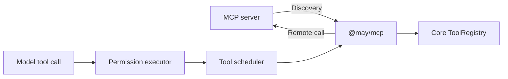

# Connect MCP servers

**English** | [简体中文](../../zh-CN/guides/mcp.md)

Use this guide to configure Model Context Protocol (MCP) servers in MaybeCode or
an application using `@may/mcp`. You need a trusted stdio server executable or
Streamable HTTP endpoint, its connection requirements, and any required account
credentials. For MaybeCode, you also need an existing May configuration and model
profile.

1. Add an endpoint using [MaybeCode configuration](#maybecode-configuration) or
   the [package API](#package-api).
2. Start MaybeCode and run `/mcp`, or inspect `pool.status()` in your application.
   A `connected` entry confirms setup and discovery; inspect its tool names.
3. Approve the remote tool through the application's normal permission interface.
4. Close the application and its pool at shutdown.

For OAuth, long tasks, graphical Apps and server exports, use the dedicated
[authentication](mcp-auth.md), [Tasks](mcp-tasks.md), [Apps](mcp-apps.md) and
[server](mcp-server.md) guides. The sections below describe configuration and Host
operations; the [capability reference](../reference/mcp-capabilities.md)
describes package and protocol boundaries.

## Why this is a separate package

`@may/mcp` owns discovery, transports and child processes. It adapts remote tools
to Core's `Tool` interface, so their execution uses the existing permission,
scheduling, cancellation, Session and tracing services.



Applications enable MCP by creating a pool. An application using only local
tools does not need the MCP package.

## Package API

In your application project, install `@may/mcp` and `@may/application`. This
integration snippet assumes you already created `model`, `localTools`,
`permissionPolicy`, `tracer` and `store`. Place `mcp-server.mjs` in the process
working directory, or supply an absolute path. If the server needs credentials,
validate and supply them through `env` before opening the pool.

```ts
import { defineAgent } from "@may/application";
import { openMcpClientPool } from "@may/mcp";

const mcp = await openMcpClientPool({
  servers: [{
    id: "workspace",
    command: "node",
    args: ["./mcp-server.mjs"],
    cwd: process.cwd(),
    required: false,
    requestTimeoutMs: 60_000,
  }],
  tracer,
});

try {
  const agent = defineAgent({
    model,
    tools: localTools,
    toolSource: () => mcp.tools,
    permissionPolicy,
    tracer,
  });
  const application = await agent.open({ store });
  try {
    console.log(mcp.status());
    const run = await application.submit({ input: "List the available project files." });
    await run.result;
  } finally {
    await application.close();
  }
} finally {
  await mcp.close();
}
```

Opening negotiates the protocol and retrieves each server's advertised capability
catalogs. Servers are required by default: a
required server failure closes already-opened servers and fails startup. A
server with `required: false` instead records a failed status and lets the
remaining servers start. `close()` is idempotent, visits every connection even
if one close fails, and owns termination of the child processes spawned by the
stdio transport.

`requestTimeoutMs` sets the per-request inactivity timeout;
`maxTotalTimeoutMs` can additionally bound total time even when progress keeps
arriving. `maxBufferSize` limits one stdio protocol message. Defaults are 60 seconds
for `requestTimeoutMs` and 10 MiB for `maxBufferSize`; `maxTotalTimeoutMs` is unset.

`pool.status()` returns a point-in-time view of every configured server,
including its connection state, discovered tool names, latest diagnostic, and
recent stderr. `pool.events` publishes connected, failed, and disconnected
lifecycle events so products do not need to parse logs.

Stdio stderr is captured through a pipe. Its sanitized tail is retained per
server for diagnostics and bounded by `stderrMaxBytes` (16 KiB by default), so
a noisy child cannot grow memory without limit. Treat this output as sensitive:
servers may print paths, tokens, or other secrets to stderr.

## Names and collisions

A remote tool is exposed to models as:

```text
mcp__<server-id>__<remote-tool-name>
```

Server ids may contain letters, digits, `_`, and `-`. Other characters in a
remote name are converted to `_`; long names receive a deterministic hash and
are bounded to 64 characters. Startup fails on any remaining collision. This
means an MCP tool never silently replaces a local tool or a tool from another
server.

The adapter preserves the remote `inputSchema` and returns MCP `content` plus
optional `structuredContent`. Protocol and transport failures become
`MCP_TOOL_CALL_FAILED`; a valid result with `isError: true` becomes
`MCP_TOOL_ERROR`, with bounded textual detail so the model can react. Core
cancellation is forwarded to the SDK. MCP progress notifications become Core
tool progress events.

## MaybeCode configuration

Add this fragment to the May configuration used to launch MaybeCode. The example
requires `tools/mcp-server.mjs` in the coding workspace and `MCP_ACCESS_TOKEN` in
the launching process environment; adjust both to your server's requirements.
MaybeCode reads endpoints from `apps.maybecode.mcpServers`:

```json
{
  "apps": {
    "maybecode": {
      "mcpServers": {
        "workspace": {
          "transport": "stdio",
          "command": "node",
          "args": ["tools/mcp-server.mjs"],
          "cwd": ".",
          "required": false,
          "env": {
            "ACCESS_TOKEN": "${MCP_ACCESS_TOKEN}"
          },
          "requestTimeoutMs": 60000,
          "maxTotalTimeoutMs": 300000,
          "maxBufferSize": 10485760,
          "stderrMaxBytes": 16384
        },
        "temporarily_disabled": {
          "enabled": false
        }
      }
    }
  }
}
```

`transport` is optional and defaults to `stdio`; `streamable-http` selects HTTP. A missing
`mcpServers` entry, `false`, or an empty object disables MCP. Relative `cwd`
values are resolved from the active coding workspace; omitted `cwd` also uses
that workspace. `required` defaults to `true`; use `false` only when the product
can continue without that server. Arguments are passed directly without a shell.

Environment values can reference the launching process with `${NAME}`. A
missing referenced variable fails startup.
Resolved environment values stay in memory and are not added to built-in
traces. Prefer references over literal secrets because the configuration file
is plaintext.

MaybeCode starts MCP before opening the workspace, adds the discovered tools to
its normal `ToolRegistry`, and closes MCP after the Agent workspace but before
flushing observability. Its default coding permission policy asks for approval
for every MCP tool. An allow-for-session decision remains scoped to the normal
MaybeCode Session permission executor.

Run `/mcp` in either MaybeCode UI to inspect configured servers, states,
discovered tools, startup errors, and retained stderr. The controller event
stream also exposes the lifecycle events for other front ends and integrations.

## Streamable HTTP and protocol modes

The same `mcpServers` map (or package `servers` array, with an `id`) accepts:

```json
{
  "remote": {
    "transport": "streamable-http",
    "url": "https://mcp.example.com/mcp",
    "headers": { "Authorization": "Bearer ${MCP_REMOTE_TOKEN}" },
    "protocolMode": "auto",
    "requestTimeoutMs": 60000,
    "maxTotalTimeoutMs": 300000,
    "required": false
  }
}
```

Header environment references expand only in MaybeCode configuration, not in
direct package API calls. Missing references fail even for optional servers.
Static headers and native OAuth discovery/login/refresh are supported; see
[MCP authentication](mcp-auth.md). Authentication does not grant tool permission.
HTTP entries reject process-only fields (`command`, `args`, `cwd`, `env`,
`maxBufferSize`, `stderrMaxBytes`); stdio entries reject `url`/`headers`.
`maxBufferSize` limits stdio messages. Configure HTTP response limits in the Host's
network boundary.

`protocolMode` accepts `legacy` or `auto`. Stdio defaults to `legacy` to preserve
existing startup behavior. HTTP defaults to SDK `auto`: discover a modern
server via `server/discover`, or fall back to a legacy `initialize` handshake
when appropriate. Opt-in stdio auto mode may launch an additional short-lived
probe process. The installed `@modelcontextprotocol/client@2.0.0` supports this
opt-in mode; its default remains legacy. Local integration fixtures verify
2025-11-25 stdio/HTTP and the 2026-07-28 HTTP tools path, not full protocol
conformance or third-party server compatibility. `/mcp` and `pool.status()`
include the negotiated protocol version.

Only HTTPS is accepted except for HTTP on `localhost`, `127.0.0.1`, or `[::1]`.
URL credentials and fragments are rejected; use headers for credentials, not
URL query strings. Redirects are never followed, including same-origin ones.
Duplicate header names (case-insensitive), invalid headers, `mcp-*`, `Host`,
`Connection`, `Content-Length`, `Transfer-Encoding`, `Upgrade`, `Accept`,
`Content-Type`, `Origin`, `Cookie`, and `Proxy-Authorization` overrides are
rejected. Configure trusted endpoints and apply network policy outside
the adapter when required, including private-network access. Remote tools send arguments to that destination;
normal tool permissions still apply.

HTTP SDK failures may contain secrets in URLs, response bodies, or causes.
Their details are withheld from public errors, status, and tracing; an HTTP
status code is retained when available. MCP `isError` tool results retain their
bounded text for the caller, but HTTP error spans do not capture that text.
No HTTP headers or URLs are added to spans. HTTP endpoints have no stderr tail.

There is no automatic reconnect, stream resumption, general tool-call retry, or fallback
to deprecated HTTP+SSE. `connected` reports successful setup and discovery.
Individual HTTP failures fail their operation;
they do not automatically remove a discovered tool. Closing attempts DELETE
for a negotiated legacy HTTP session (at most five seconds, or the shorter
request timeout), then always closes local transport resources. It does not
delete remote user data. No remote session is created by the modern protocol.

## Tracing and security

With a tracer, the adapter emits:

| Span | Meaning |
| --- | --- |
| `may.mcp.connect` | transport setup and protocol negotiation |
| `may.mcp.tools.list` | initial and refreshed capability discovery |
| `may.mcp.tool.call` | one remote call, parented to the Core tool span |
| `may.mcp.disconnect` | client and process shutdown |

Attributes include server id, transport, exposed and remote tool names, ids,
counts, status, and duration through the tracer. Built-in instrumentation does
not capture command arguments, environment values, request input, response
content, prompts, or model messages.

A local stdio MCP server executes with the host user's authority.
It can also supply model-visible tool descriptions. Only configure trusted
servers, review their command and package source, apply least-privilege
environment and filesystem access, and keep the permission layer enabled.

## Current scope

The pool supports dynamic tools, resources/templates, prompts, completion,
resource watches and scoped user interaction. Roots/Sampling compatibility,
Tasks and Apps require explicit Host options. Independent server exports use a
separate entry point. See the [capability reference](../reference/mcp-capabilities.md)
for supported versions and limits.

## Dynamic catalogs and endpoint recovery

Use `toolSource: () => mcp.tools` on the Agent definition alongside static
`tools`; passing `mcp.tools` into a constructor instead intentionally pins that
collection. Configured MaybeCode uses the dynamic source automatically, including
after model/session changes. New catalogs affect the next Run/continue, never
an in-progress Run. Old snapshots reject with `MCP_STALE_TOOL` if a definition
changed/disappeared or the catalog became untrustworthy. The wire request is not
sent. A reconnect closes the old connection, so its snapshots cannot execute.

- `mcp.catalog()` returns deeply frozen per-server metadata: revision,
  capabilities, tools, resources, resource templates and prompts. Only advertised
  capabilities are queried; resources-only endpoints are valid. Metadata is
  untrusted server data, not permission to load URIs or execute prompts.
- `await mcp.refresh(serverId?, signal?)` explicitly refetches all advertised lists
  and publishes only a complete candidate. Each list has a 64-page cap, repeated
  cursors/duplicate identities fail closed, and retained candidate data is capped
  at 4,096 descriptors/8 MiB across lists. The refresh deadline is 60 seconds or
  `maxTotalTimeoutMs`. The Host separately manages HTTP-body memory limits.
- Advertised list-change notifications invalidate tools immediately and schedule
  one coalesced refresh. Modern endpoints use `subscriptions/listen`, legacy
  endpoints use notification handlers. Concurrent invalidations allow at most
  three discovery attempts; failure preserves the prior metadata as stale and
  removes its tools from new Runs. No content is automatically read or attached.
- `await mcp.reconnect(serverId, signal?)` replaces only that configured endpoint,
  including optional endpoints that failed startup. In-flight tool calls make
  reconnect fail. Old Run
  snapshots must be abandoned; the new connection gets new permission identity.
- `/mcp refresh [server-id]` and `/mcp reconnect <server-id>` expose these actions
  in both terminal UIs. `/mcp` shows revision/staleness and notification coverage
  (`active`, `partial`, `unavailable`, `legacy`, `not-advertised`). Lost modern
  subscription streams are visible failures, not silent healthy subscriptions;
  refresh/reconnect is explicit. `mcp.server.catalog-updated` signals publication.

Tool grant identity includes the complete remote definition (including output
schema/annotations), endpoint/account configuration and a connection generation,
without exposing configuration secrets. Unchanged refreshes preserve grants;
reconnect/recovery creates a new identity. After an explicit OAuth login, run
`/mcp reconnect <server-id>` before starting another Run. Each connection owns
its cache; catalogs are retained in pool memory and explicit refresh never trusts
a server's prior TTL. Closing cancels queued/active discovery and subscriptions.

## Resources, prompts, completion and attachments

The pool exposes host/user-driven `readResource`, `readResourceTemplate`,
`getPrompt`, `complete` and `subscribeResource`. These are Host operations. Call
them for authorized user intent or explicit host policy; the application enforces
access control. They
accept cancellation/trace context and share the endpoint lifecycle.

The following fragment assumes an open `mcp` pool and an operation `signal`.
Replace the URI, template and prompt names with entries from `mcp.catalog()`.

```ts
const read = await mcp.readResource("workspace", "project:///README", { signal });
const expanded = await mcp.readResourceTemplate(
  "workspace", "project:///{path}", { path: "README" }, { signal },
);
const prompt = await mcp.getPrompt("workspace", "review", { file: "main.ts" }, { signal });
const suggestions = await mcp.complete("workspace", {
  ref: { type: "ref/prompt", name: "review" },
  argument: { name: "file", value: "ma" },
}, { signal });
const watch = await mcp.subscribeResource("workspace", read.uri, { signal });
// watch.events 提供更新通知；需要内容时明确重新读取。
await watch.close(); // watch.closed 也报告远端或连接关闭。
```

Both terminal UIs support these commands. Enter JSON directly without shell
quoting; its internal whitespace is preserved:

```text
/mcp catalog [server-id]
/mcp read server-id resource-uri
/mcp template server-id uri-template {"path":"README"}
/mcp prompt server-id prompt-name {"file":"main.ts"}
/mcp complete server-id {"ref":{"type":"ref/prompt","name":"review"},"argument":{"name":"file","value":"ma"}}
/mcp attach server-id resource-uri What does this contain?
/mcp use-prompt server-id prompt-name {"file":"main.ts"}
/mcp watch server-id resource-uri
/mcp unwatch server-id resource-uri
```

`read`, `template` and `prompt` only preview. `attach` and `use-prompt` explicitly
start a Run with a **user message**, atomically prepared on the Session state
queue. Ctrl+C/close cancel preparation without attaching data to a later Session.
Remote prompt role labels remain data, not actual assistant/system history.
`mcpResourceToUserMessage` and `mcpPromptToUserMessage` preserve untrusted MCP
provenance. Resource links stay inert JSON: neither local file reads nor automatic
URL downloads. Watch notices never change the model Context.

Results allow 128 blocks/8 MiB, validating base64/MIME; oversize results fail rather
than silently truncating structured data/binary. Terminal previews allow 16,000
characters, replacing binaries with labels. Media becomes provider-neutral base64
content; unsupported model media fails with `UnsupportedContentError`, not silent
text conversion. The generic `Tool.resultContent` hook projects MCP multimodal and
structured output to the model, while raw tool events retain the original result.
`_meta` stays host-only. Completion validates catalog references/argument names,
allows 100 suggestions/64 KiB and ten calls/second/connection. Terminals request on
Enter; GUI hosts should debounce typing.

The resource LRU honors positive TTLs (maximum five minutes), bounded to 32 entries/
16 MiB per connection. Missing TTL means no reuse. `cache: "refresh"` refetches;
`"bypass"` neither reads nor writes cache. Resource/list notifications invalidate
entries; updates racing a read prevent stale cache writes. Even `public` results
are never shared across endpoints/accounts/connections. OAuth grant generation is
checked before cache hits and after reads: separate-process login/logout cannot
expose old private cached data. Reconnect when the grant changes.

Modern watches use `subscriptions/listen`, legacy uses subscribe/unsubscribe.
Each URI shares a reference-counted remote stream, with independently cancellable
local handles and 32-notice buffers; at most 64 handles/connection. Lost streams
settle `closed`, never silently reconnect. Closing releases all handles. HTTP JSON
bodies and each SSE frame are capped at 10 MiB before SDK parsing; stdio keeps its
configurable bound and ordered notification/response delivery.

## Scoped user interaction (modern MRTR)

Modern `tools/call`, `resources/read` and `prompts/get` can pause for form or URL
elicitation. The host binds each continuation to the originating logical request.
The SDK handles fresh wire ids and opaque `requestState` echoing. An uncertain
failed tool call requires separate investigation before starting a new operation.

Both MaybeCode terminal UIs enable interactions. They show the server and Session,
accept a JSON form, allow editing, and require a separate `send` confirmation.
`decline` and `cancel` are explicit alternatives. Form answers are excluded from
input history. Never enter credentials in forms. URL mode shows the HTTPS host
and URL, requests consent, and leaves navigation to the user; `retry` explicitly
continues after visiting. It does not fetch the URL, open a browser, forward MCP
credentials, or claim the external workflow has completed. This is separate from
MCP client OAuth login.

For a custom Host, create one broker per pool and consume its events concurrently.
This fragment assumes configured `servers`, trusted `workspaceIdentity` and
`sessionId`, and an operation `signal`. The Host implements the event consumer
and calls `interactions.respond()` with a user-reviewed answer.

```ts
import { McpInteractionBroker, openMcpClientPool } from "@may/mcp";
const interactions = new McpInteractionBroker();
const pool = await openMcpClientPool({ servers, interactions });
const owner = { workspaceId: workspaceIdentity, sessionId };
// 并发消费 interactions.events，验证归属并取得用户审阅结果。
// 使用 interactions.respond(request.id, request.owner, userReviewedResponse) 回答。
const read = await pool.readResource("remote", "project:///README", { owner, signal });
await pool.close(); // 同时关闭由 pool 管理的 broker。
```

Use one broker per pool with one UI consumer; do not share it between pools.
`list(owner)` recovers currently pending questions from the bounded best-effort
stream. Omit the broker when no UI is available: elicitation is then unadvertised
and input requests fail closed without invoking a model. `openConfiguredMaybeCode`
also defaults to no broker; pass `mcpInteractions: true` only when consuming and
answering its controller events. The interactive CLI does this automatically.

For tool calls, `MayOptions.toolScope()` returns trusted host string labels; Core
snapshots them once per Run and adds them as `ToolExecutionContext.scope`, not model
arguments. `AgentApplication` supplies its own `sessionId` and accepts host
`toolScope` labels; MaybeCode adds its resolved workspace as `workspaceId`.
Direct pool tool callers must supply those labels themselves. The MCP adapter
adds Run/tool-call ids and a random logical request id; owner labels never enter
MCP `_meta`. `McpOperationOptions.owner` provides the equivalent host-operation
scope. Missing ownership prevents interactive prompting.

Headless product UIs consume `mcp.interaction.requested` / `settled`, inspect
`getMcpInteractions()`, and call `respondMcpInteraction(id, response)`. Answers bypass
the Session state queue so resource preparation and tools cannot deadlock waiting
for their own queued answer. Reads/previews and attachments pin their Session
while executing; cancellation releases queued Session changes. Retained dialogs
are ephemeral, scrollable, independently dismissible and do not submit agent turns.

Limits: eight protocol rounds, 32 total host-input requests per logical flow, 32 pending
questions per pool, 32 form fields, 64 KiB request/response and 4,096-character
messages. Forms support flat primitives and single/multi-select enums; unsupported
schema keywords, external references and arbitrary regexes are rejected. Responses
are validated without coercion or automatic defaults; extra fields are refused.
`requestTimeoutMs` remains the SDK request timeout and tool progress can reset it.
An absolute deadline is added only when `maxTotalTimeoutMs` is configured; it also covers UI waiting.
Each host interaction is bounded from arrival by the request timeout (60 seconds when unset),
clipped to any configured absolute deadline. Cancel/expiry/close removes pending
questions, cancels queued dialogs and rejects late/duplicate/wrong-owner answers.
The host rechecks authorization identity and catalog/tool validity before each
continuation; changing login while a question is open never sends old state under
a new principal. Resource caches additionally partition by workspace and Session.

Questions/answers are not independently persisted or traced by the broker; a
server can still return supplied data as normal resource/tool output. Unscoped legacy push requests decline; explicitly isolated legacy operations
can interact as described below. Roots and Sampling are explicit compatibility
options, never enabled merely by installing a server. Tasks are separately opt-in; independent server export is separately opt-in; this feature does not claim complete MCP conformance.


## Roots, Sampling and legacy compatibility

Roots and Sampling are explicit compatibility features, **off by default**.
Both are deprecated in MCP 2026-07-28. New integrations can use direct provider
APIs for model access.
Enabling them does not grant access to Session history or executable host tools.

In a MaybeCode server entry (stdio or HTTP), opt in separately:

```json
{
  "host": {
    "roots": true,
    "sampling": true,
    "legacyRequests": "isolated"
  }
}
```

An active interaction broker/UI is also required. Direct package callers supply
`hostServices: McpHostServices` with a `roots(context)` allowlist callback and/or
`sampling.createMessage(params, context)`. Enabling a service without supplying
it fails configuration when a broker is present; without a broker no host
capabilities are advertised. Callbacks receive the trusted owner, logical request
id, deadline and abort signal, not Core Context. Check ownership in custom services.

- **Roots:** MaybeCode offers only its current workspace. The host canonicalizes
  accessible local `file:` paths, deduplicates them, and asks for read-only consent
  before sharing with the server. Decline sends an empty list; the server cannot
  nominate a path. Up to 32 roots / 64 KiB are allowed, with accessibility checked
  again after approval. Roots provide workspace guidance; tools enforce filesystem access.
  No `roots.listChanged` capability is advertised; each request obtains fresh roots.
- **Sampling:** the UI first reviews/edits the exact isolated request, then separately
  reviews/edits the response before disclosure. Declining the response cannot undo
  already incurred provider usage. Limits are 48 KiB per request/result, 64 messages,
  32 tools, 4,096 output tokens per request and four requests / 16,384 reserved output
  tokens per logical flow. `includeContext` other than `none` is rejected. There is
  no implicit retry or host Session inclusion.
- `createMcpModelSampler(factory)` bridges a host-selected provider-neutral `Model`:
  one fresh, bounded model request, without a May execution loop or ToolRegistry.
  The factory receives approved `maxTokens` and must enforce it at the provider;
  the model must declare a positive `limits.maxOutputTokens` no larger than that
  bound. MaybeCode creates a separate base provider instance using its selected
  profile and overrides both `maxTokens` and `maxOutputTokens`. Optional server
  model/temperature/stop hints and request metadata are not forwarded by this
  bridge; host provider configuration wins.
- Sampling sends server-declared tool definitions and converted tool history for
  model output. It does not invoke local tools.
  Text, supported inline image/audio and tool history are bounded; unsupported
  output fails explicitly, and URLs/files are not fetched. Reasoning, model state
  and response `_meta` are withheld. Custom sampling services may omit `supportsTools`.

Every disclosure rechecks authorization/catalog state. Cancellation/expiry stops
local waiting and removes pending reviews; late callback results are discarded.
Filesystem/provider errors are sanitized before reaching the server. Custom
callbacks must honor the signal and provider budget: the host cannot forcibly
terminate arbitrary JavaScript or undo a model request already processed remotely.

`legacyRequests: "isolated"` opts eligible legacy `tools/call`, `resources/read`
and `prompts/get` operations into a **fresh process (stdio) or connection/session
(HTTP) for each operation**, at most eight per endpoint. Before sending the user's
operation, the child must match the parent protocol and complete catalog; parent
and child validity are rechecked during interactions. The channel has exactly one
trusted owner, is never reused, and closes after completion/cancellation or pool
shutdown. No uncertain operation is replayed. A cached resource read can still
incur child discovery. Per-process/session state is **not retained between these
operations**; opt in only for servers supporting independent sessions. Shared
legacy tools still work without this option, but unsolicited/startup callbacks
never acquire an owner: elicitation declines, roots are empty and sampling fails.


Opt-in modern Tasks support durable handles, explicit get/update/wait/cancel,
restart recovery and user-controlled completed-result attachment. Enable `tasks: true`
with a journal; see [long-running tasks](mcp-tasks.md) for version, UI and safety boundaries.

Optional graphical integration and terminal fallback: [isolated Apps Host](mcp-apps.md).

Independent, authenticated tool/resource/prompt exports use `@may/mcp/server`.
See [server authoring](mcp-server.md).

## Troubleshooting

| Symptom | Check and action |
| --- | --- |
| Startup fails before connecting | Check environment references, transport-specific fields, command path and required endpoint diagnostics |
| Endpoint reports `auth-required` | Complete [OAuth login](mcp-auth.md), reconnect the endpoint and start a new Run |
| `MCP_STALE_TOOL` | Refresh or reconnect the endpoint, then start a new Run with the current catalog |
| Resource watch closes | Inspect `watch.closed` and endpoint status; explicitly refresh or reconnect before creating a new watch |
| An interaction expires | Confirm the UI consumes broker events concurrently and the request timeout permits user review; start a new authorized operation |
| Remote call has an unknown outcome | Verify the remote effect before creating another call; consult [recovery](recovery.md) |
