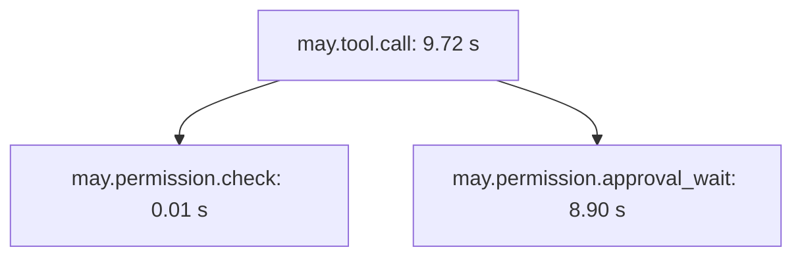

# Configure observability and tracing

**English** | [简体中文](../../zh-CN/guides/observability.md)

Use this guide to record Run timing, usage, metrics and diagnostics. You need an
existing May application and a destination for local files, console output or
OTLP export. `@may/observability` provides tracing and diagnostic implementations;
`@may/plugin-observability` can own them through an Application plugin.

For a complete configuration-backed example, see
[model validation and execution diagnostics](model-telemetry-integration.md).
The following sections describe direct tracer configuration and available
telemetry data.

## Events, history, and traces

- `MayEvent` and `AgentApplicationEvent` drive live presentation and lifecycle
  observation.
- `SessionEvent` is an append-oriented durable fact used for resume and
  history.
- A trace is sampled operational data. It may be buffered or dropped and must
  never be the source of truth for Session or permission state.

One `may.run` span identifies a Run. Model, Context, tool-batch, and tool-call
spans are its children. Permission spans are children of the relevant tool
call. A Session adds `may.session.id` to the Run; separate Runs in the same
Session remain separate traces.

## Configure a tracer

Core exports the `Tracer`, `TraceSpan`, `TraceContext`, attribute types and
protected telemetry-call helpers. In your consuming project, install
`@may/application` and `@may/observability`. This integration snippet assumes
already configured `model`, `tools`, `permissionPolicy` and `store`.

```ts
import { defineAgent } from "@may/application";
import {
  BasicTracer,
  BatchSpanProcessor,
  ConsoleSpanExporter,
  ratioSampler,
} from "@may/observability";

const processor = new BatchSpanProcessor(
  new ConsoleSpanExporter(),
  {
    maxQueueSize: 2_048,
    maxExportBatchSize: 256,
    scheduledDelayMs: 2_000,
  },
);

const tracer = new BasicTracer({
  processor,
  sampler: ratioSampler(0.1),
  resourceAttributes: { "service.name": "example-agent" },
});

const definition = defineAgent({
  model,
  tools,
  permissionPolicy,
  tracer,
  traceAttributes: { "may.agent.name": "example" },
});

try {
  const application = await definition.open({ store });
  try {
    const run = await application.submit({ input: "Inspect the project" });
    console.log(run.traceContext?.traceId);
    await run.result;
  } finally {
    await application.close();
  }
} finally {
  // 所有共享该 processor 的应用关闭后，释放导出资源。
  await processor.shutdown();
}
```

`AgentDefinition` captures the tracer as a caller-owned collaborator and
shallow-snapshots `traceAttributes`. Each Run may add more content-free
attributes or an explicit parent `traceContext`. `ModelStreamOptions`,
`ToolExecutionContext`, `RunHandle`, and `AgentRun` expose propagated trace
context for provider, remote-tool, and parent-operation integration.

## Built-in spans

| Span | Purpose |
| --- | --- |
| `may.application.open` | Create/resume and validate one application Session |
| `may.run` | Root Core Run, outcome, counts, and aggregate token usage |
| `may.context.snapshot` | Prepare the model-visible Context snapshot |
| `may.context.append` | Append input, assistant, or tool-result messages |
| `may.model.call` | One model stream, usage, tool-call count, and retry events |
| `may.tools.batch` | Schedule one model response's tool calls |
| `may.tool.call` | Parse, authorize, and execute one Tool |
| `may.permission.check` | Evaluate the permission policy |
| `may.permission.approval_wait` | Wait for an explicit approval decision |
| `may.context.compact` | Explicit application-requested compaction |

The following illustrative timings show how an approval wait contributes to a
tool's duration. They are example values:



That separates user wait time from the remaining tool execution time. A model
span's `may.model.retry` event similarly distinguishes provider retry delay
from Context preparation or tool latency.

## Processors, exporters, and sampling

- `InMemorySpanProcessor` retains completed spans for tests and inspection.
- `SimpleSpanProcessor` serializes asynchronous exporter calls.
- `BatchSpanProcessor` uses a bounded queue and exposes `droppedSpans`; it
  never applies exporter backpressure to a Run.
- `InMemorySpanExporter` and `ConsoleSpanExporter` are included.
- `JsonlFileSpanExporter` serializes local JSONL appends and can rotate by
  local calendar date with a bounded retention window.
- `alwaysOnSampler`, `alwaysOffSampler`, and `ratioSampler()` select root
  traces; child spans inherit their parent's decision.

Processors own asynchronous export and lifecycle. Call `forceFlush()` when a
checkpoint needs all queued spans and `shutdown()` once at the actual owner.
Closing one application must not shut down a processor shared by another.

`BatchSpanProcessor` reports synchronous and asynchronous exporter failures through
`onError`, releases the failed batch, and continues exporting later batches.
`forceFlush()` and `shutdown()` finish after the queued export attempts complete.

External tracing systems should be integrated through a custom
`SpanExporter` or `SpanProcessor`. Keep provider SDK types outside Core.

## Enable tracing in MaybeCode

In the May configuration used to launch MaybeCode, add the following fragment,
then start the workspace. The first exported spans create the dated file:

```json
{
  "apps": {
    "maybecode": {
      "observability": {
        "enabled": true,
        "exporter": "file",
        "file": "traces/traces.jsonl",
        "samplingRatio": 1,
        "retentionDays": 60
      }
    }
  }
}
```

When enabled, every application opened or rebuilt by the workspace shares one
tracer and batch processor. MaybeCode flushes it only after the whole workspace
closes. `file` is a base path; the local date is inserted before its extension.
A relative path is based on the MaybeCode data directory, making the default
files `~/.may/maybecode/traces/traces-YYYY-MM-DD.jsonl`.

MaybeCode retains 60 local calendar days, including today, unless
`retentionDays` overrides it. On the first export of each day it removes only
older files matching the configured base name and date pattern. Unrelated
files are not touched.

With no `observability` entry, or with `false`/`enabled: false`, MaybeCode's
behavior remains unchanged and no trace file is created. See the
[configuration reference](../reference/configuration.md) for batch settings.

## Privacy and failure behavior

Built-in instrumentation records names, ids, counts, timings, statuses, token
usage, permission decisions, and content-free error type/code metadata. It does
not capture prompts, messages, reasoning, tool inputs/outputs, or credentials.
Custom `traceAttributes` are caller data: do not place secrets, large payloads,
or unbounded user-controlled values in them.

Core wraps injected tracer and span calls. Provided processors catch exporter
failures and optionally report them through `onError`. A broken telemetry
backend therefore cannot fail or cancel Agent work. Tracing provides operational
diagnostics with bounded, sampled export. The Host independently persists audit
and Permission records with the retention and delivery guarantees it requires.

## Independent metrics and local diagnostics

Add these objects to the preceding direct tracer setup. The fragment assumes
the imported `BasicTracer`, `ratioSampler`, existing `processor` and Session
identity `sessionId`. Read the snapshots after an operation finishes.

```ts
import { BoundedMetrics, DiagnosticsStore } from "@may/observability";

const metrics = new BoundedMetrics({ maxSeries: 1_024 });
const diagnostics = new DiagnosticsStore({ maxSpans: 2_048, maxActiveSpans: 512 });
const tracer = new BasicTracer({
  processor, metrics, observer: diagnostics, sampler: ratioSampler(0.1),
});
const page = diagnostics.getDiagnostics({ sessionId, limit: 100, offset: 0 });
const snapshot = metrics.getMetrics();
```

Lifecycle observations and metrics include every local span, including
unsampled operations. Only sampled spans reach the export processor. Active
counts increase at start and decrease once at completion. Counts, statuses,
durations, first output times, retries, measured retry waits, token details,
cost, missing data, and processor queue/delivery diagnostics are available.
Cost counters preserve `currency`, `cost_kind`, and `cost_complete` labels.
Metric labels use an allowlist that excludes Session, Run, task, user, and trace
identifiers. The default series limit is 1,024; `droppedSeries` reports overflow.
Histogram snapshots include cumulative buckets, count, and sum. Hosts can record
queue gauges through `Tracer.recordMetric`.

`DiagnosticsStore` retains 2,048 completed spans, 512 unfinished spans, and one
hour of local records by default. Query by `traceId`, `taskId`, `coordinationId`,
`sessionId`, or `runId`, with at most 500 results per page. Results expose `evictedSpans`,
`coverage`, `total`, and `hasMore`; spans include `ended`, `sampled`, parent
identity, timing, usage, cost, and content-free errors. Local parent correlation
is inherited. Parallel operation durations must be displayed independently;
elapsed task time comes from task start and end times.

## Model calls and attempts

`may.model.call` identifies a logical request, including all retries and waits.
Its children `may.model.attempt` identify physical attempts with independent
status, duration, completion, and usage availability.
Invalid requests rejected by `Model.preflight` retain a failed logical call with
zero physical attempts. The stable `modelCallId`
is supplemented by `may.model.attempt_id`. `RetryingModel` reports attempts
through `ModelStreamOptions.attemptObserver`; May records one attempt for an
ordinary adapter. Model wrappers preserve `reportsAttempts` and forward the
observer.
`attemptObserver.retryWait` reports measured waiting time, including elapsed
waiting before cancellation. `may.model.retry_wait_ms` retains the logical
call's accumulated retry waiting time.

`may.model.first_content_ms` measures the first nonempty text/reasoning delta,
tool response, or completed nontext content. `may.model.first_text_ms` measures
the first nonempty displayable text. Logical-call timing includes retry waits;
attempt timing starts at that attempt. Missing timestamps remain absent.
Cancellation, protocol errors, successful empty responses, and tool-only
responses retain outcome independently of `has_content` and `has_text`.
Each attempt records usage availability; failed attempts without usage retain
explicit missing state.

Model-call metadata includes adapter/model configuration, capability version,
cached/reasoning token details, and the exact pricing result used by budgets.
Cost includes currency, estimated/provider kind, completeness, and price identity
and version. Use completeness alongside the amount.

Usage completeness uses `resolveUsageTotals`, consistently with Run budgets.
When a provider completes a response that fails JSON/Schema validation, its
known Usage and cost remain recorded: the attempt and logical call report an
error with `may.model.completed=true`. May charges the receipt once before
Context persistence and completion Hooks. A final `modelEvent` Hook failure
also retains the received receipt; invalid responses produce no successful
completion event and are not appended to Context. Failed Run spans expose the
budget's accumulated tokens, cost, and completeness. Budget or pricing failures
preserve the response validation cause and known token quantities. Token and
cost counters are recorded once at logical-call completion.

## OpenTelemetry and OTLP

`OpenTelemetryTracer` adapts a host-owned OpenTelemetry API tracer with explicit
parent propagation. `OpenTelemetryMetricRecorder` adapts a meter independently
of trace sampling and limits metric series. The convenience composition owns
official SDK providers and HTTP/JSON exporters without registering globals.
The snippet assumes a running OTLP HTTP collector at the two URLs and the
`diagnostics` store from the preceding section. Applications use
`telemetry.tracer`; close them before calling telemetry shutdown.

```ts
import { createOtlpTelemetry } from "@may/observability";

const telemetry = createOtlpTelemetry({
  serviceName: "example-agent",
  tracesUrl: "http://localhost:4318/v1/traces",
  metricsUrl: "http://localhost:4318/v1/metrics",
  timeoutMs: 5_000, maxQueueSize: 2_048, maxExportBatchSize: 256,
  samplingRatio: 0.1, observer: diagnostics,
});
// Application 使用 telemetry.tracer，全部关闭后释放 SDK。
await telemetry.forceFlush();
console.log(telemetry.getDiagnostics());
await telemetry.shutdown();
```

Both HTTP endpoints are explicit. Optional `headers` stay outside telemetry.
Queue size, batch size, export concurrency, timeout, metric series, and lifecycle
waits have limits. Lifecycle completion waits for trace and metric operations.
Export and lifecycle failures reach `onError` and diagnostic counters.
`shutdown()` is idempotent. Hosts with existing SDKs use the direct adapter and
continue to own their providers.

## Correlation and acceptance

Core's versioned `TelemetryCorrelation` validates parent identity and task,
coordination, dispatch, scheduler, and resumed-Run IDs. Hosts send it with remote
execution and use `correlationTraceAttributes` for span metadata. A resumed
execution creates new identities and references its previous Run through
`resumedFromRunId`. Received correlation must be validated before execution.
Local diagnostics cover operations observed in the local process.

The following fragment assumes a `DiagnosticsStore` and independently collected
verification evidence. Record the assessment only after the evaluator completes;
replace the identities, versions and reference with your actual values.

```ts
diagnostics.recordAssessment({
  taskId: "task-123", sessionId: "session-123", coordinationId: "coordination-123",
  evaluator: "file-checks", evaluatorVersion: "2",
  result: "passed", configurationVersion: "context-policy-3",
  evidenceReferences: ["artifact:checks-123"],
});
```

Results are `passed`, `failed`, or `inconclusive`, with evaluator version,
configuration version, timestamp, and evidence references. The host authorizes
evidence access and stores evidence independently. The default assessment limit
is 256; each record accepts at most 16 references of 256 characters each.

Assessment scopes accept `sessionId`, `runId`, `coordinationId`, and `traceId`.
When recording, missing scope fields are inferred only when retained task spans
identify a unique value. Scoped queries strictly match these saved fields;
ambiguous records remain accessible through independent `taskId` queries.
Saved assessment scope survives span eviction. Include Session or coordination
identity when task names can repeat in different executions.

## Limits and delivery diagnostics

Attributes allow finite scalars and bounded scalar arrays. Defaults permit
64 attributes, 256 characters per string, 16 array elements, and 64 retained
events; content and credential keys are rejected. The host remains responsible
for custom values. `InMemorySpanProcessor` and `InMemorySpanExporter` default
to 2,048 retained spans with configurable limits and `droppedSpans`.
`SimpleSpanProcessor` uses bounded one-span batches. `BatchSpanProcessor` accepts
`metrics` for queue length, drop, and failure statistics; `getDiagnostics()`
reports queue size, exporting, dropped spans, failures, timeouts, and closed state.
Export and shutdown default to five-second timeouts. Ordinary failed batches
release their data and later batches continue. Export timeout closes the
processor and discards pending records to bound unfinished export operations;
`shutdown()` releases exporter resources.

## Verification

After enabling telemetry, perform a real application operation and confirm Run
and child identities, Session filtering, usage completeness and cleanup. Use
`droppedSpans`, `coverage` and queue diagnostics when deciding whether a query
contains all retained evidence.

From the repository root, run `pnpm --filter @may/observability test` for local
processors, metrics, diagnostics and OpenTelemetry integration. External collector
delivery and provider usage require their own configured services.
