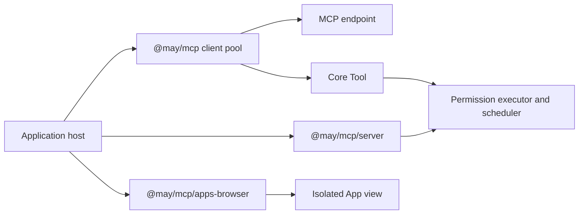

# MCP host capabilities and boundaries

**English** | [简体中文](../../zh-CN/reference/mcp-capabilities.md)

This reference describes the implemented MCP integration and its
verification surfaces. For connection instructions, use the [MCP guide](../guides/mcp.md).
The package adapts protocol operations at the application boundary; Core retains
tool execution, permissions, scheduling and cancellation as defined by
[ADR 0006](../architecture/decisions/0006-mcp-adapts-to-core-tools.md).

## Package boundaries



The host chooses endpoints, credentials, interaction services and exported
capabilities. Client tools use the normal Core executor. Independent server
exports receive that executor explicitly. Core and `@may/application` have no
MCP dependency. The browser entry point has no Node dependencies.

## Implemented capabilities

| Capability | Host responsibility | Guide and focused tests |
| --- | --- | --- |
| Stdio and Streamable HTTP | Configure trusted processes or endpoints; own pool shutdown | [Connect MCP](../guides/mcp.md); `packages/mcp/test/mcp.test.mjs` |
| Native OAuth | Configure trusted authorization origins and secure credential storage; complete login | [Authentication](../guides/mcp-auth.md); `oauth.test.mjs` |
| Dynamic catalogs | Use per-Run tool snapshots; explicitly refresh or reconnect when needed | [Catalogs](../guides/mcp.md#dynamic-catalogs-and-endpoint-recovery); `catalog.test.mjs` |
| Resources, prompts and completion | Authorize reads and explicitly attach selected content | [Content operations](../guides/mcp.md#resources-prompts-completion-and-attachments); `capabilities.test.mjs` |
| Form and URL interaction | Consume the broker concurrently and review each response | [Host interaction](../guides/mcp.md#scoped-user-interaction-modern-mrtr); `interactions.test.mjs` |
| Roots and Sampling compatibility | Enable each service explicitly; review disclosure and enforce provider budgets | [Compatibility](../guides/mcp.md#roots-sampling-and-legacy-compatibility); `host-services.test.mjs` |
| Long-running Tasks | Supply a journal and trusted owner; explicitly inspect, update, wait or cancel | [Tasks](../guides/mcp-tasks.md); `task-journal.test.mjs`, `task-runtime.test.mjs` |
| Isolated Apps | Supply consent, an authenticated renderer channel and a dedicated sandbox origin | [Apps](../guides/mcp-apps.md); `apps.test.mjs`, `test/browser/apps.test.mjs` |
| Independent server exports | Supply authentication, authorization, explicit exports and public result projections | [Server exports](../guides/mcp-server.md); `server.test.mjs` |

Except for the first path, test filenames in the table are relative to
`packages/mcp/test/`. Product integration is covered by MaybeCode's configured
MCP, command and capability tests.

## Protocol compatibility

| Surface | Supported version or mode |
| --- | --- |
| Modern client and server core | `2026-07-28` |
| Client legacy negotiation | Stdio defaults to `legacy`; HTTP defaults to `auto` |
| Independent legacy server | Explicit `legacy: "stateless"` |
| Tasks extension | `io.modelcontextprotocol/tasks`, `2026-07-28` |
| Apps UI | `2026-01-26`, negotiated independently of core |
| TypeScript SDK | Client and server 2.0.0 |

The Tasks integration uses flat handles and `tasks/get`, `tasks/update` and
`tasks/cancel`. The 2025 experimental Tasks protocol is unsupported. Task status
uses explicit polling; task subscription notifications are unavailable. The
retired two-endpoint HTTP+SSE transport is unsupported.

## Ownership and side effects

Tool snapshots bind a remote definition to an endpoint, authorization identity
and connection generation. A stale definition fails before a wire call. Reconnect
creates a new connection identity and requires a new Run snapshot.

Interactive continuations retain their original workspace, Session and logical
request. Credential changes invalidate pending continuations. Task journals retain
that ownership across restart and write a local reservation before task creation.
Apps have one authenticated renderer and a bounded lifetime. Server requests use
authenticated principals supplied by the host.

An unknown tool outcome requires investigation. The client does not automatically
replay tools or reconnect. Stopping a local task wait leaves remote work running;
remote cancellation is an explicit cooperative request. Task results enter Context
only through explicit attachment. Apps receive only host-selected data. Server
exports require a public result projection and expose no implicit Session history.

## Security services supplied by the host

- Enforce filesystem and network access for local processes and remote endpoints.
- Keep credential records in a secure store; the desktop vault requires a working
  OS keyring.
- Authorize resource reads, prompt use, interaction responses and App data sharing.
- Serve Apps through a dedicated origin and retain the sandbox response's headers.
- Provide server token verification, revocation checks and protected-resource
  metadata when deploying OAuth.

The independent server exports immediate allowlisted tools, fixed resources and
prompts. Resource templates, completion, subscription streams, Tasks, Apps and
server-initiated Host requests are outside that serving surface.

## Verification

From the repository root, use the pnpm version in `package.json`:

```powershell
pnpm --filter @may/mcp test
pnpm --filter @may/mcp exec playwright install chromium
pnpm --filter @may/mcp test:browser
pnpm docs:check
```

The first command builds the package and runs its offline tests, including local
HTTP endpoints and stdio child processes. The browser command checks origin
isolation, CSP, message-source validation and cleanup. Native keyring checks and
external model or third-party server checks have separate prerequisites; report
their results separately. Passing these checks does not establish universal MCP
conformance.
