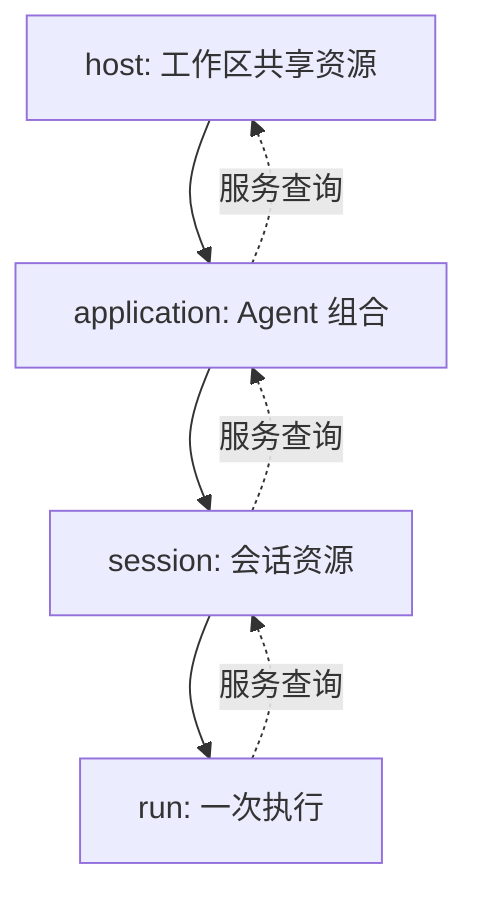

# 插件组合与生命周期

[English](../../en/architecture/plugins.md) | **简体中文**

本文解释 May 已实现的插件宿主，包括服务何时可用、嵌套范围如何管理资源，以及
Hooks 如何参与执行。声明和加载插件参阅[插件指南](../guides/plugins.md)。

## 概念

Plugin 是具有配置和生命周期的功能单元。Service 是具名、带类型的能力，包含版本、
范围和实现。Hook 是具有验证规则及明确转换或观察行为的执行入口。PluginHost 验证
插件组合，管理初始化、变更和资源清理。

## 组合与服务

插件声明稳定 id、Semantic Version、配置 schema、提供的服务、必需和可选依赖、
必需 Hooks 以及 setup。服务具有稳定 id、版本、能力及 host、application、session
或 run 范围。任何 setup 执行前，必需服务和 Hooks 必须存在。重复提供方、版本不兼容、
能力不足、循环依赖及对更短生命周期实例的依赖都导致验证失败。可选依赖允许明确缺失。
宿主要求明确选择服务提供方。

提供方初始化成功后，服务才对外可用。使用方通过声明的依赖访问服务。一个插件可以
共同管理多个服务及 Hooks，包括 runtime 与相应 Context。调用方提供的共享实例仍由
调用方管理；明确提供清理方法时，可以转交资源管理责任。

## 生命周期与范围

Run 插件可以使用 Session 服务和 Application 的 Model。Application 插件不能
依赖 Run 服务，因为后者在之后创建，并且更早结束。每个子范围创建自己的实例。

host、application、session 和 run 构成嵌套范围。初始化遵循依赖顺序，清理遵循依赖
逆序。监听器、计时器、连接和后台操作具有明确管理者。初始化失败后停止后续初始化，
清理已经创建的资源。清理继续处理剩余资源，并集中报告错误。关闭时拒绝新操作；重复
关闭保持安全。

配置修改、增加、移除和替换按顺序执行。移除现有提供方前，验证完整的新依赖图。
使用相关资源的操作必须完成，或者取消并等待终止。等待变更期间阻止相关新操作。
替换初始化失败后，相应范围保持不可执行，持久历史继续允许读取。Session 状态具有
明确 schema 版本及迁移方法，恢复执行前必须验证。

## 状态与替换

插件状态声明数字版本、初始值及可选 schema 与迁移。读取返回副本，已经接受的
`set()` 和 `update()` 验证数据并等待配置的保存方法完成后才报告成功。
Application 和 Session 状态保存在 `may.plugins` 下，Run 状态仅临时保存。
历史保留未知插件的状态记录。

替换过程中，活动操作完成写入后，宿主暂停新的状态调用，并等待已经接受的调用
结束。清理完成后初始化替换实例，新的 setup 可以更新恢复的状态。不兼容的插件
版本或状态版本需要明确迁移。运行时替换还通过 Session 生命周期方法保存并恢复
运行时说明和具有版本的状态。

## Hooks

入口覆盖 application 创建与关闭、输入提交、Run 开始与结束、Step 边界、Context
视图及压缩、模型请求与输出及失败、工具参数与执行及结果、审批观察和恢复。
runtime 声明支持的 Hooks；缺少必需 Hook 时，组合验证失败。

转换依次按照显式 order、配置中的插件顺序、注册顺序执行。输入和替换结果复制后
经过验证。观察者不能修改执行数据。被等待的 handler 具有超时和取消信号。
控制操作失败时当前操作失败；允许隔离失败的观察入口必须报告错误。插件卸载时清理
handler 注册。

工具参数转换发生在最终验证和权限判定之前。权限判定后，参数保持不变。Hooks 无法
扩大宿主权限。原始工具结果与转换后的模型可见内容分别保留。消息、状态、压缩和继续
请求通过 Session 保存并等待确认。取消、Run 预算及宿主 yield 优先于继续请求。
恢复过程不重复执行历史工具。

## 内置插件组合

共享服务标识与有序贡献登记由 `@may/plugin-services` 提供。runtime、Context、
Model、权限、Skills、goals、history-memory、delegation、MCP、observability、
投递、channels、Agent adapters、coordination 和 Web/API 通过
`packages/plugins/` 中的可复用工厂提供。产品配置和组合位于应用的 `src/plugins/`
目录，package 不导入应用。

工具和指令贡献具有稳定标识及清理方法。每个新 runtime 按照显式 order、插件声明
顺序及登记顺序应用 Model 和 Context 包装。Context 配置可以根据包装后的 Model
生成。工厂声明服务与 Hook 依赖；配置组合没有提供对应服务时，选择产品默认提供方。
替换服务收到当前 Application 的创建通知。

工作区 MCP 和 tracing 资源在 Session 切换期间共享，由所属宿主关闭。adapter
registry 按需创建实例、验证能力，并移除已释放实例。coordination registry 释放
已完成的 runtime。渠道插件管理自己的接收过程；投递记录保留已确认、等待处理和
结果未知的状态。HTTP 关闭会关闭连接并等待请求完成，随后清理产品路由。清理在
遇到错误后继续释放资源，并报告全部清理失败。

## 集成与验证

AgentDefinition 选择插件；AgentApplication 打开相应范围并接入 Session 状态。
默认 May loop 由 runtime 插件通过可替换 factory 提供。MaybeCode 和 MaybeClaw
支持产品插件选择，直接调用方式保持有效。

`packages/plugin/test/` 覆盖组合验证、范围、Hook 顺序、清理、变更与状态迁移。
Application 测试覆盖 Session 状态集成与运行时替换。在仓库根目录执行
`pnpm --filter @may/plugin test` 和 `pnpm --filter @may/application test` 验证
这些行为。`pnpm test:package:plugin` 在仓库外安装打包后的完整依赖，并执行公开
导出接口。这些检查使用本地资源，外部 provider 集成需要单独验证。
