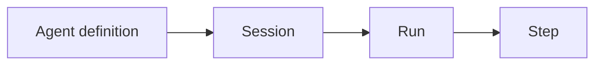
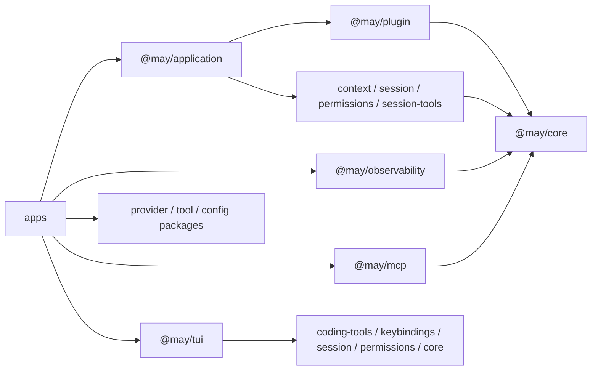

# Runtime 与 Session 边界

[English](../../en/architecture/runtime-session.md) | **简体中文**

本文说明 Agent 执行、对话状态和应用资源分别由哪些包管理。
设计扩展或检查可复用包与产品之间的依赖时，可以依据这些职责选择位置。

May 使用四个生命周期层级：

应用编排管理这些层级。`AgentApplication` 拥有一个
活动 Session；产品创建、恢复或重新配置 Session 时，`AgentWorkspace` 负责选择并
替换活动 Application。

插件资源使用嵌套的 `host`、`application`、`session` 和 `run` 范围。
所属应用创建这些范围，解析声明的服务，并触发生命周期 Hooks。
参阅[插件与服务](../guides/plugins.md)。

## 生命周期归属

概念定义和执行示例见
[Agent 定义、Application 与 Workspace](../concepts/agent-application.md)及
[Session、Run 与 Step](../concepts/session-run-step.md)。

每次打开的应用拥有独立的进程内生命周期。一个 Session 最多允许一个活动 Run，
每个持久化 Session 身份要求一个活动写入者。可能访问同一份历史的应用由宿主协调。
Session 存储保持独立，内存对话无需引入文件系统依赖。

## 包职责

可复用代码位于 `packages`，可执行产品组合位于 `apps`。依赖规则为：

图中显示依赖方向，各个包的完整依赖以其 `package.json` 为准。可复用
包不导入应用，任何包都不导入 `apps/maybecode`。

### `@may/core`

Core 负责活动执行：

- `Model`、`Tool` 和 `Context` 接口；
- 实例级、可迭代的 `ToolRegistry`，用于按名称进行无歧义组合与查询；
- Run/Step 循环；
- 实时 Run 事件与取消；
- 通过可替换的 `ToolExecutor` 和 `ToolScheduler` 分配工具调用；
- 标准化多模态内容，以及 Provider 自有转换边界。

Core 运行时默认拒绝重叠 Run，因为它只拥有一个可变 Context。Session 还会把提交
串行化为生命周期策略。`May` 接受任意 `Iterable<Tool>`，并在构造时快照工具集合，
所以之后修改源数组或注册表不会改变该运行时。

Core 不负责 Session 发现、持久化、恢复、分支、UI 状态或某种具体权限策略。它
支持临时的一次性 Run。Core 只拥有为自身执行插桩所需的小型
`Tracer`/`TraceSpan` 接口与显式 `TraceContext` 传播，不导入具体遥测实现或厂商 SDK。

### `@may/context`

Context 包提供工厂和 Core 最小 `Context` 接口的可复用实现。应用可以
通过工厂替换模型可见历史的保存或选择方式。它不拥有 Session 身份
或持久化历史。

工厂还可以提供 `ContextController`，供应用检查、手动压缩以及模型调用前的自动
压缩。Core 在请求快照时传递 Run 元数据和取消信号；策略选择和持久化替换由应用管理。

模型适配器可以提供 Provider 原生 Context 压缩器。Core 只定义不透明
能力边界；`@may/context` 将其适配进自动策略链，Provider 自行通过
`modelState` 序列化和恢复原生续接状态。

### `@may/session`

Session 包把 Core 组合成长生命周期身份。它负责 Session 标识、元数据、串行
提交、Context 连续性、Session 事件和存储接口，也提供可复用的内存及文件 Catalog。
它可以依赖 `@may/core`，但 Core 不得依赖它。

Session 通过 `AgentRuntime` 执行。默认实现为 `May`；自定义运行时工厂
可以共同管理 Context 和其他资源。Session 保存运行时身份及具有版本的状态。
替换期间，在插件服务仍然可用时保存状态并关闭旧运行时，恢复新运行时后允许执行。

完整请求通过 `run.settled` 保存状态边界后，可以作为分支位置。`Session.fork()`
将选定位置的历史复制到独立身份，并持久记录来源位置。Context、Provider 续接
和运行时状态使用该边界；应用状态通过声明选择。审批授权和未消费输入保持独立。
`AgentApplication` 提供 Skills 与声明的插件状态恢复，`AgentWorkspace` 提供 Session
分支树和关联目录的生命周期。Git 版本和 worktree 由工作区宿主管理。
`Session.fork({ deferForkReady: true, ... })` 将持久化就绪标记交给 `saveForkReady()`。
`AgentApplication` 在验证、created Hooks、工具检查和排队状态写入全部成功后保存标记。
初始化失败时保留部分历史，拒绝恢复和分支。`AgentWorkspace` 在关闭或替换来源之前
保存新 Session 的 Catalog 记录；Catalog 失败时保留新历史，来源 Application 继续活动。

### `@may/plugin`

Plugin 包负责组合验证、带类型和版本的服务、范围初始化、配置与状态验证、
生命周期 Hooks、串行变更以及资源清理。它依赖 Core 的 Hook 接口。
Application 提供运行时和 Context 服务，并通过 Session 存储保存插件状态。

### `@may/permissions`

工具定义能力，终端交互由产品提供。Core 提供通用 `ToolExecutor` 接口；权限
包实现该接口，用于允许、拒绝或暂停执行并等待审批。策略接收已解析的工具
输入，审批事件构成独立于 UI 的协议：TUI 负责渲染请求并返回决定。

权限执行器支持一次性决定、Session 范围授权，以及通过注入 `PermissionRuleStore`
保存的持久规则。应用为每个 Session 创建独立执行器，关闭时清除 Session 授权。
持久规则继续保存在配置的存储中；每次相关执行都检查可信范围、工具定义、有效期和策略。
执行器等待事件保存，使 Session 能在工具结果之前保存审批请求和决定。
优先级、撤销和资源管理见[权限策略](../guides/permission-policy.md)。

### `@may/observability`

Observability 包是 Core 追踪接口的可选实现，提供采样、不可变的已完成 Span、
内存及串行或有界处理器和基础导出器。依赖方向从 `@may/observability` 指向
`@may/core`：Core 定义自己所需的能力，外层可选包实现它，再由产品注入。

追踪失败不阻止 Agent 执行，追踪数据允许采样、缓冲或丢弃，不能代替 Session 历史或
权限记录。内置 Span 不记录提示内容、消息、推理和工具输入输出。
Tracer 与处理器生命周期由调用方管理，可以在多个 Application
之间共享遥测资源。

### `@may/mcp`

MCP 包是位于工具边界的可选适配器。它依赖 Core 的 `Tool` 与追踪接口，
Core 不依赖 MCP 或其 SDK。客户端池拥有 stdio 子进程与 Streamable HTTP 传输，通过
发现带版本的 tools/resources/templates/prompts 元数据目录，并公开由 `tools/call`
支撑的每 Run 不可变工具描述。追加式 `toolSource` 为后续 Run 发布最新目录，活动 Run 保持原有目录。
列表通知触发元数据刷新；重连需要显式操作，绝不重放工具调用。宿主驱动的资源、
提示和补全输出有界不可信内容，显式附件准备和提交共享 Session 状态队列。Core
只认识通用 `Tool.resultContent` 投影 Hook。

客户端池还提供服务端即时状态视图与有序连接生命周期事件。必需服务端失败会使应用
启动失败；可选服务端以失败诊断保留，同时健康服务端继续工作。有界、已净化
的 stderr 末尾片段属于客户端池诊断状态，不属于 Agent Context 或 Session 历史。

应用通过 `ToolRegistry` 组合适配器工具，已解析输入
先经过配置的 `ToolExecutor`（包括权限检查）和 `ToolScheduler`，再开始进程
I/O。运行时取消会传播到远程请求。打开客户端池的产品管理它及其进程的生命周期。

### `@may/application`

Application 包提供位于 Session 与 Core 之上的独立于 UI 的编排。
`AgentDefinition` 保存可跨 Session 复用的模型、工具、指令、权限、Context、工具执行
和调度策略；`defineAgent()` 是创建它的便捷函数。Definition 的 `open()` 把这些策略与
本次 Session 的存储、标识和元数据组合起来。
`AgentApplication` 拥有一个持久化 Session，并集中负责：

- 从注入的模型、工具、Context 工厂、权限策略、指令和存储创建或恢复 Session；
- 提交、重试、取消、审批处理和安全关闭；
- 转发标准化的 Run 与权限事件；
- Context 检查、压缩取消，以及持久化改变后的模型可见 Context；
- 可选安装有界 `session_history`，并保存模型不可见的工具显示元数据。

`AgentWorkspace` 增加活动 Session Catalog、自动恢复、创建/恢复/重命名/删除、Catalog
摘要和 FIFO 状态迁移队列。产品可以通过 `transitionApplication` 在同一 Session 上
重建活动 Application，或用 `runStateTransition` 串行化产品自有配置操作。

这些类提供排序和依赖注入接口。进程级 Agent-definition 注册表、Provider
注册表、Definition 序列化、系统提示内容、编码权限策略、模型配置、UI 命令和终端渲染由产品提供。
Definition 会保存工具集合快照，不会克隆调用方拥有的模型、Context 工厂、
执行器或调度器等有状态协作者；同一 Definition 多次打开时，每个 Application
都有独立的进程内 Session 对象，这些有状态协作者仍会共享。当前 JSONL Session 存储
和追加式文件 Catalog 是轻量本地后端，不提供崩溃恢复事务或多主机写入协调。

### `@may/tui`

TUI 包是 May 的终端组件包，支持 Agent 概念。它在一个包
内保留两个层级：

- `Text`、编辑器、选择、滚动、覆盖层、焦点、屏幕缓冲区、渲染器
  和 Node 终端适配器等终端基础组件；
- `TranscriptStore`、`TranscriptView` 和实例级 `ToolRendererRegistry` 等 Agent 投影。

Agent 层消费 Core、权限与 Session 事件并构建保留式对话视图，通过
`@may/tui/transcript` 和 `@may/tui/tool-renderers` 暴露。产品标签、提示、布局、命令
和控制器调用仍由应用提供。图形或远程 UI 可以直接消费与 UI 无关的控制器。

### `apps/maybecode`

MaybeCode 负责产品组合。它选择和配置可复用包，使用
`ToolRegistry` 组合编码工具，通过 `defineAgent()` 捕获通用行为，把单 Session 和
Workspace 生命周期交给 `@may/application`，使用 `@may/tui` 的 Agent 对话视图，并
形成终端编码 Agent 产品。任何可复用包都不依赖 MaybeCode。

应用只保留产品策略和兼容适配：

- MaybeCode 提示内容、指令来源策略和 shell 运行时指导；
- 默认编码工具、变更预览生成和编码权限策略；
- 命名手动压缩选项和有序自动压缩链；
- Provider 与模型配置、推理强度覆盖和默认模型持久化；
- 可选的本地追踪配置，以及共享处理器的生命周期管理；
- 可选的 stdio / Streamable HTTP MCP 配置，以及共享客户端池的生命周期管理；
- 斜杠命令、产品事件、主题、页面布局、模型与 Session 选择流程，以及 `classic`
  与 `retained` 两种终端行为。

`MaybeCodeApplication` 在 `AgentApplication` 上提供产品组合。它将通用
工具显示事件映射为变更预览事件，同时委托 Run、审批、历史、Context
和关闭操作。`MaybeCodeWorkspace` 同样包装 `AgentWorkspace`，主要保留模型
配置与推理强度策略。

它明确的产品 UI 边界是 `MaybeCodeController`：用户意图通过方法表达，异步模型、
工具、权限、Context 和 Session 变化形成 `MaybeCodeEvent` 事件流。
`MaybeCodeWorkspace` 实现该独立于 UI 的接口。随项目提供的前端使用此接口，其他 UI
也可复用同一个控制器。MaybeCode 渲染和命令策略由相应前端提供。
`MaybeCodeTerminal` 为 `classic` 前端提供行式 I/O 适配器；自定义 UI 使用 `MaybeCodeController`。

## 事件与持久化

`MayEvent` 提供一个 Run 的实时观察，可能包含流式增量。当有界
事件转发队列丢弃高频增量时，处理较慢的消费者可能看到序号缺口；最终结果和持久化
事实不依赖保留每个增量。

`PermissionEvent` 报告实时审批请求及其处理或取消，以及 `rule.created`、
`rule.used` 和 `rule.revoked` 事件。Application 接受 `permissionRuleStore`，
依据宿主可信范围和稳定的工具定义身份复用规则。宿主根据操作人员身份提供 `createdBy`。
Session 保存审批范围与规则证据，模型 Context 保持独立；恢复过程取消尚未完成的审批。
Session 分支忽略权限记录，新执行器根据配置的规则存储和范围重新检查权限。
`SessionEvent` 记录持久化的
Session 事实，例如提交消息、完整助手消息、审批、工具结果和 Run 边界。
应用也可以记录带命名空间和版本的 `tool.presentation` 元数据。Session
提供这些数据，模型 Context 的回放保持独立。UI 状态是事件投影，持久化历史保存事实。

Session 包提供内存存储，以及可选的 Node.js JSONL 文件存储入口。Session
可以从持久化历史重建 Core Context；历史模型不依赖终端 UI 或某种特定后端。

追踪是第三种观察通道：它记录因果关系、耗时与状态，允许采样或丢弃，
也不会回放进 Context。参阅[可观测性与 Tracing](../guides/observability.md)。
