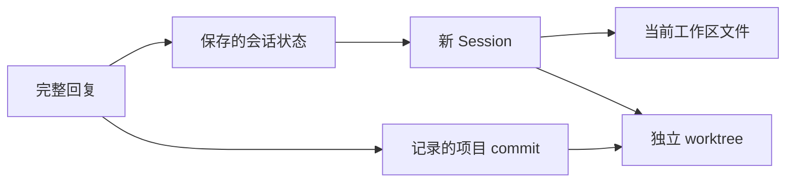

# Session 分支与 Git checkpoint

[English](../../en/architecture/session-forks-and-checkpoints.md) | **简体中文**

状态：已实现。公共组件 API 参见 [Session 文档](../../../packages/session/README.md)、
[Runtime 与 Session 架构](runtime-session.md)和 [Git 工作区指南](../guides/git-workspaces.md)。

本文面向需要实现会话分支、文件版本显示与 worktree 管理的宿主和 UI 作者。
功能使用步骤见 Git 工作区指南。

## 目标与概念

Session 分支从选定历史位置创建独立 Session，保留来源关系，并允许继续提交请求。
文件 checkpoint 使用项目 Git commit 表示回复对应的文件版本。
worktree 为 Session 提供独立的工作目录与 Git branch。

Session 分支关系与 Git branch 分别记录。多个 Session 可以使用同一工作区；同一
工作区中的 Session 共享当前文件内容和 Git branch。独立 worktree 使用各自的目录
和当前 branch。界面必须区分当前工作区状态与历史回复记录的版本。

通用 Session 分支支持任意宿主。Git 初始化、自动提交和 worktree 管理适用于具有
项目文件工作区的应用。`Session.fork()`、`AgentApplication.open({ fork })` 和
`AgentWorkspace.forkSession()` 提供公共 Session 分支能力。
`ProjectGitWorkspace` 提供 Node.js 文件版本管理；MaybeCode 将这些组件接入
TUI、WebUI 和客户端协议。

两种模式均恢复保存的会话状态。当前工作区模式使用当前文件，独立 worktree 从
记录的 commit 开始。

## 产品行为

- 项目工作区默认使用 Git 管理版本，允许通过显式配置关闭自动提交。
- 已有 Git 仓库使用现有仓库；尚未使用 Git 的工作区自动初始化仓库。
- 每轮修改完成后自动创建项目 commit，作为文件 checkpoint。
- Session 分支支持当前工作区和新建 worktree 两种方式。
- 新建 worktree 的默认根目录为用户目录中的 `.may/worktrees/`。
- TUI 的 `/fork` 打开树形历史位置选择器。
- WebUI 和客户端在完整 Agent 回复之后提供分支入口。
- 各类 UI 固定显示当前工作区的 Git branch。
- checkpoint 和 diff 使用项目 Git 历史，UI 将版本信息关联到会话历史。

## 完整回复与分支位置

用户界面以一次完整请求处理为主要历史单位。同一轮中的模型调用、工具调用、检查
及修复属于该轮处理。工具执行及审批等待结束，运行状态和可恢复状态保存完成后，
该轮才成为可选择的分支位置。

执行中的 assistant 消息不自动成为分支位置。流式文本尚未完成、工具结果未知或
状态保存失败的位置必须显示原因，并限制分支操作。历史记录缺少可恢复状态时，
不得将其他位置的状态用于该分支。

新 Session 具有独立身份，记录来源 Session、来源历史位置、关联工作区和 Git
版本。恢复内容包括选定位置的模型可见 Context、provider `modelState`、runtime
状态、Skills 状态及声明支持分支的应用状态。历史工具操作不会重新执行。
新 Session 保留已经交付的 steering 输入历史，排除待执行输入、运行进程及审批记录和授权。
`forkStateKeys`、`forkPluginIds` 和 `forkStateTransform` 明确选择并迁移应用和插件状态。
Skills 参与恢复；MaybeCode 迁移工作区内的 Skill 路径，并保留声明支持分支的
Context notes 和 history memory。
MaybeCode 在模型配置改变时保存 provider、model、adapter、profile 和 reasoning effort。
创建历史分支时先选择原有 profile 与参数，然后恢复 Context。profile 的当前配置
解析为不同 provider、model 或 adapter 时，创建操作报告错误。直接提供 Model 和
身份信息的宿主需要提供相同身份；没有模型身份信息时使用 Runtime 的兼容处理。

`run.settled` 在 Runtime 与应用状态保存完成后标记成功的可恢复位置。
`session.created.fork` 记录来源 Session、sequence 和 Run；`session.fork.ready`
标记分支历史保存完成。未完成复制的历史无法恢复。Session 存储需要支持只读 `inspect()`。

## 分支交互

### TUI

`/fork` 打开树形历史位置选择器，展示用户请求、完整回复和已有 Session 分支。
默认选择最近的可用完整回复，支持键盘导航、搜索、展开内容预览和取消操作。
每个可选位置显示时间、请求与回复摘要，以及关联文件版本的可用状态。

确认位置后，选择当前工作区或者新建 worktree。完成创建后进入新 Session，输入
区域为空，等待用户继续提交请求。选择器不触发模型摘要请求。

### WebUI 与客户端

完整回复后的分支入口直接选定对应历史位置，然后进入工作区模式选择。
历史位置、可用状态和分支结果与 TUI 使用相同的宿主能力。

## 工作区模式

### 当前工作区

新 Session 使用选定位置的会话状态，保留当前工作区文件内容和当前 Git branch。
界面明确说明会话起点与当前文件状态，并让 Agent 获知文件可能已在之后发生变化。

例如，第二轮结束时 `a.ts` 内容为 A，第四轮结束时内容为 B。从第二轮创建当前
工作区分支后，历史截止第二轮，读取 `a.ts` 时得到 B。

历史文件恢复作为独立操作处理，需要明确目标、影响范围及恢复预览。
diff 视图提供文件恢复入口，展示预览并要求明确确认；应用预览时登记一次性标识，
确认请求使用这个标识执行已经审阅的操作。

### 新建 worktree

使用选定回复关联的 commit 作为起点，创建独立工作目录与 Git branch。
以上例从第二轮创建 worktree 后，新目录中的 `a.ts` 内容为 A。

默认目录结构为 `.may/worktrees/<projectId>/<worktreeId>`，根目录允许配置。
名称和路径必须避免冲突。来源仓库与 commit 必须可用；关联版本缺失时报告原因，
不得静默使用另一个文件版本。

MaybeCode 根据选定目录重新创建工作区工具和 Skills。配置的 MCP 连接由各个工作区
分别管理：stdio 的相对工作目录使用对应 worktree，项目外部的绝对目录保留配置值，
host roots 使用当前工作区。返回某个工作区时复用其连接。关闭宿主时释放全部工作区
连接和共享 tracing processor。

创建新 Session 与创建 worktree 需要有可检查的完成状态。部分操作失败时保留明确
的关联记录和诊断，禁止显示已经进入可用的新 Session。

## 默认 Git 管理与初始版本

已有仓库使用当前工作区所属仓库，包括位于仓库子目录或 Git worktree 的项目。
尚未使用 Git 的项目自动初始化仓库并建立初始 commit。已有未提交修改作为初始
checkpoint 保存，使后续回复的文件变化具有明确起点。

工作区准备和初始版本保存成功后，Agent 才开始修改文件。Git 不可用、身份未配置、
初始提交失败或仓库状态无法支持操作时，明确报告原因，保留文件及可读取的会话。
关闭自动提交后，界面显示实际管理状态，仅将已存在的可用版本用于文件 checkpoint。

`apps.maybecode.git` 接受 `false`，或包含 `autoCommit`、`readOnly`、`dataRoot`、
`worktreesRoot`、`excludedPaths` 的对象。默认开启自动 Git 管理。
只读模式允许问答，保留仓库和文件状态，不创建 commit 或 checkpoint 状态文件。
宿主通过 `authorizeCommit` 提供授权，项目要求的审批在修改 Git index 之前进行。
授权拒绝时保留文件与 index 状态。

提交范围遵循项目 Git 管理范围与忽略规则，不自动扩大到仓库之外。不会打印或提交
凭据。已有 staged 修改在 index 与工作内容相同时参与提交；内容不同会触发明确错误。
Git 忽略规则和配置排除项继续生效，Git 工作区指南列出默认凭据路径排除规则。
已被 staged 的排除文件需要明确处理。自动提交拒绝子模块和发生变化的嵌套仓库。
进行中的 merge、rebase、cherry-pick、revert 和 sequencer 操作需要处理完成。
detached HEAD 使用当前 commit，并显示对应状态。
Git 操作之前核对仓库根目录和 common Git directory，身份变化时报告需要重新打开工作区。

## 每轮提交与 checkpoint

请求生命周期使用以下规则：

- 一轮正常完成的处理至多创建一个自动 commit；提交发生在修改、检查及修复结束后。
- 没有文件变化时关联当前 commit，保留回复位置与文件版本的关系。
- commit message 使用英文，描述该轮最终修改。
- 保存 `sessionId`、`runId`、历史位置、工作区、开始和结束 commit、当时 branch
  以及提交结果。标识的持久保存不依赖解析 commit message。
- 提交失败时记录 checkpoint 保存失败，保留文件修改，明确显示可恢复能力。
- 失败、yielded 和取消的请求保留未提交修改并记录状态。后续成功请求以已有 commit
  为比较起点，将保留的符合范围的修改纳入结果版本。

Goal 完成宿主验证后保存最终 checkpoint，包括其最终 Run 因调度而 yielded 的情况。
Goal Run 的完成回调在验证期间保留工作区互斥保护，然后保存最终文件版本及带有
`hostCompleted: true` 的 `run.settled` 历史位置。验证未通过、验证错误和取消操作
保留文件修改并释放互斥保护。

一次完整请求可以包含多个主 Run 和子任务。宿主保持一个 Git lease 覆盖完整请求，
共同记录最终 `runId` 与参与的 `runIds`。中间主回复需要等待完整请求的文件版本
保存完成后，才能作为新 worktree 的文件起点。

自动 commit 保存本轮工作区变化。期间的人工修改可能包含在其中，diff 不能统一
标记为 Agent 修改。手动 commit 和 branch 切换需要保留实际版本来源。

重新打开 Session 时核对当前仓库状态与保存的版本。提交成功但会话记录保存失败时，
持久化 Git 操作记录用于恢复已经完成的 commit，保持一次处理的提交数量。
恢复核对准备好的 tree 和 parent 身份；期间历史变化导致状态无法确认时要求检查。
checkpoint 与 Session 历史位置的关联独立保存。

## diff 展示

提供本轮变化、整个 Session 的变化以及历史版本与当前工作区的比较。
本轮比较使用处理开始和结束版本；未提交变化明确显示为当前工作区变化。

TUI 默认显示文件数量、增加与删除统计。打开变化列表后，使用键盘选择文件，查看
彩色 unified diff，支持滚动、搜索及修改位置导航。WebUI 和客户端提供对应的
文件列表与 diff 视图。二进制文件及无法生成文本 diff 的文件显示其类型和状态。

执行文件恢复前展示恢复预览，重新验证当前文件状态。发现预览之后发生修改时终止
恢复并报告冲突。读取历史文件内容后，通过文件写入组件完成恢复操作。

`ProjectGitWorkspace.previewRestore()` 保存当前内容指纹与目标文件内容。
`restore(preview, options)` 验证所有已审阅指纹，在相同工作区文件互斥保护期间
通过常规文件写入和删除恢复选定文件，并保存结果 checkpoint。
symbolic link 父目录和 Git 元数据路径触发错误；二进制文件保留原始内容。
文件操作失败时报告部分完成状态，保留供检查的信息。

TUI `/changes [run <run-id>|session|workspace|commit <commit>]` 选择比较范围。
文件列表使用 `Enter` 查看 patch、`/` 搜索、`]` 跳到下一处修改、`R` 打开恢复预览、
`Y` 确认恢复。

## branch 显示与状态更新

TUI 在底部状态栏显示 branch；WebUI 和客户端在会话顶部或固定工作区信息区域
显示 branch。detached HEAD 显示该状态与简短 commit hash。仓库尚无 commit
时显示初始化状态；仓库读取失败时显示错误状态。

同一工作区中的相关 Session 同步显示当前 branch。初始化、自动提交、切换 Session、
创建 worktree 及外部 Git 状态变化后刷新状态。历史回复继续展示当时记录的 branch
与 commit，不随当前 branch 名称变化重写。

宿主需要向 UI 提供工作区 Git 状态、初始版本结果、提交结果、checkpoint 可用状态、
Session 分支结果及 worktree 生命周期信息。UI 使用结构化记录生成显示内容。

## worktree 管理与保存生命周期

worktree 管理记录来源仓库、来源 Session、分支位置、起点 commit、目录、branch、
关联 Session 和当前状态。提供列表、打开和明确的删除操作。

关闭 Session 保留 worktree。删除 Session 与删除 worktree 分别操作。删除目录前
检查关联会话、运行进程、未提交修改及未合并 commit，并明确说明需要保留的内容。
May 只自动管理自己登记的 worktree。

checkpoint 随项目 Git 历史保存，关闭程序后仍然可用。必须保留有效 checkpoint 的
Git 可达关系，特别是在删除 worktree branch 或用户修改历史之后。删除 Session
不自动删除项目 commit；其他 Session 引用的历史版本继续保留。
每个 checkpoint 和比较起点分别通过持久化 `refs/may/checkpoints/` 和
`refs/may/checkpoint-starts/` 引用保护，没有自动过期或引用清理。

同一工作区的写入和自动提交需要协调，防止其他 Session 的修改混入正在完成的轮次。
独立并发修改使用独立 worktree。文件互斥跨进程保护仓库工作目录，所属进程终止后
支持恢复。活动进程、其他主机、身份无效及无法确认的操作记录触发明确错误。

`/worktrees [open|delete <id>]` 列出、打开或请求删除登记的 worktree。
删除检查目录与 Git 身份、关联 Session、登记的运行进程、已追踪/未追踪/忽略文件、
branch 身份和未合并 commit。Session 创建失败时登记失败状态，保留 worktree 路径和诊断。
checkpoint 状态目录和 worktree 根目录要求位于来源仓库之外。
