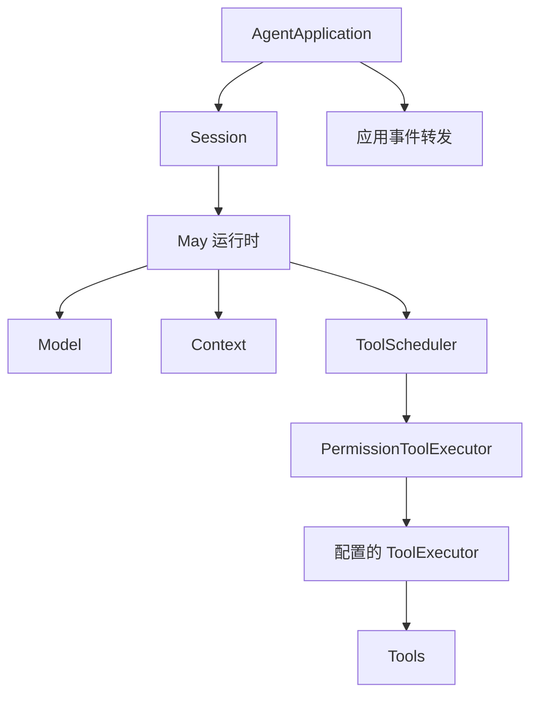

# Agent definition、Application 与 Workspace

[English](../../en/concepts/agent-application.md) | **简体中文**

应用需要定义 Agent 行为、打开对话并管理活动工作。`AgentDefinition`、
`AgentApplication` 和 `AgentWorkspace` 为这些职责提供独立生命周期。完整包
边界见 [Runtime 与 Session 边界](../architecture/runtime-session.md)，生命周期
术语见 [Session、Run 与 Step](session-run-step.md)。这两个组合对象的架构取舍记录在
[ADR 0004](../architecture/decisions/0004-agent-definitions-and-tool-registries.md)。

## `AgentDefinition`：可复用行为与策略

**Agent definition** 是决定 Agent 如何工作的可复用产品配置，通常包括：

- 一个 `Model`；
- 指令；
- 工具，以及可选的自定义 `ToolExecutor` 和 `ToolScheduler`；
- `PermissionPolicy`；
- `ContextFactory`、Context 容量预算和压缩策略；
- 最大 Step 数、是否提供 Session 历史工具等应用选择。

`@may/application` 导出 `AgentDefinition` 类和便捷函数 `defineAgent()`。
对话相关的 `store`、`sessionId`、`resume`、`fork`、`metadata` 和 `contextMetadata`
在 `open()` 时提供。下面的组合片段假定宿主已经初始化模型、工具、指令、权限策略
和存储；完整应用步骤见[构建 Agent](../guides/building-an-agent.md)。

```ts
import { defineAgent } from "@may/application";

const agent = defineAgent({
  model,
  tools,
  instructions,
  permissionPolicy,
});

const application = await agent.open({
  store,
  metadata: { workspace: process.cwd() },
  contextMetadata: { workspace: process.cwd() },
});
```

需要使用构造函数时，`new AgentDefinition(options)` 与 `defineAgent(options)`
等价。Definition 本身没有 Session 标识、对话历史、活动 Run、事件流或需要关闭的
独立生命周期。同一个 Definition 可以多次 `open()`；每次调用都会创建互相独立的
`AgentApplication` 和 Session 生命周期。用 `sessionId` 与 `resume: true` 可以重建已有
Session。

每次打开创建独立的进程内生命周期对象。同一持久化 Session 要求一个活动写入者。
Definition、Application 和内置存储没有协调相同 `sessionId` 的多个应用；
宿主应由一个 Application 或 Workspace 独占写入。

创建 Definition 时，工具 `Iterable<Tool>` 会立即被遍历并按当时内容保存。因此，之后
修改原数组或 `ToolRegistry` 不会改变该 Definition。Context 容量预算、自动压缩策略数组和
Session 历史选项也会被浅复制并冻结。单个 `Tool` 对象、`Model`、
`ContextFactory`、`ToolExecutor`、`ToolScheduler`、策略闭包和压缩
策略等协作者不会被复制；它们仍由调用方拥有，并会被同一 Definition 打开的
多个 Application 共享。需要隔离这些对象时，应为每个 Definition 构造独立实例。

这一区分在恢复时很重要：`@may/session` 恢复持久化的对话事实，但不会重建模型、
工具、提示内容或权限策略。应用必须再次提供这些组件。Session 元数据可以标识或
校验产品配置，May 尚不会版本化或迁移任意 Agent definition。

## `AgentApplication`：一个活动 Session

`AgentApplication` 管理一个持久化 `Session`，独立于具体 UI。
通常由 `AgentDefinition.open()` 创建；需要动态、一次性的全部配置时，也可以直接调用
`AgentApplication.open()`。两条路径最终都把产品配置组合为：



直接调用时，必需输入为模型、`SessionStore` 和权限策略。使用 Definition
时，模型和权限策略在定义阶段提供，`SessionStore` 在 `open()` 阶段提供。
工具、指令、Context 配置、Session 身份和其他策略均可选。两条路径都会在构造 Core
运行时前保存工具集合快照。重要的对象归属规则包括：

- `metadata` 会复制到新 Session，创建或恢复后可用于校验。
- `contextMetadata` 经 Context 发送给模型请求；未指定时使用 Session 元数据。
- `resume: true` 必须同时提供 `sessionId`。恢复从持久化消息重建运行时，同时使用
  应用当前提供的配置。
- `sessionHistory` 需要显式启用。启用后应用安装有边界的 `session_history` 工具并保留
  该工具名。
- `createToolPresentation` 可在权限评估前产生应用自有、带版本的显示数据。数据会被
  持久化，但不会加入模型 Context。
- 自定义 Context 可以省略管理控制器；此时 Context 检查或压缩不可用。

该类实现与 UI 无关的 `AgentController`，支持提交、重试、取消、审批处理、
历史查询、Context 检查和压缩，以及关闭。事件通道见[事件与持久化](events.md)。

### 活动操作规则

一个 Application 同时只允许一个活动 Run 或 Context 压缩。`submit()`、`retry()` 和
`compactContext()` 会拒绝冲突操作。`cancel()` 优先取消活动 Run，否则取消活动压缩，
并返回是否找到可取消操作。

`AgentApplication` 同时实现 `SteerableAgentController`。
`steer({ input, inputId?, runId? })` 保存补充输入，当前 Step 继续执行。全部工具和审批
等待完成后，补充输入按接收顺序进入 Context，随后由下一次模型请求读取。明确提供
`runId` 时，它必须对应当前 Run。`listSteeringInputs()` 返回 `pending`、`delivered`、
`idle` 或 `cancelled` 状态。`delivered` 表示输入已经保存为 Context 内容，模型可能
仍未开始处理该输入。

没有活动 Run，或者原 Run 在交付前完成或交还控制时，宿主按顺序调用
`startSteeringInput(inputId, options?)`，通过返回的 `AgentRun` 管理后续执行。
`options` 可以继续提供 `shouldYield`、执行预算和取消信号。宿主交还控制的判断优先于
当前 Run 内的输入交付。取消、失败和进程中断会将未交付输入保留为 `cancelled`；
用户明确重新提交时需要新的输入标识。全部输入状态可以通过 Session 恢复。
操作正在启动或者正在压缩 Context 时，补充输入请求被拒绝。
`cancelSteeringInputs(reason?)` 保存全部 `pending` 和 `idle` 输入的取消状态，
已交付输入保持不变。宿主的停止操作同时调用它和 `cancel(reason)`，从而取消
当前操作及其等待中的工作。
`submit()` 和 `continue()` 分别接受 `SessionSubmitOptions` 和
`SessionContinueOptions`。这些 Session 接口以及 `startSteeringInput()` 会在执行前
拒绝自定义 `stepInputSource`，并抛出 `TypeError`。需要保存历史的补充输入通过
`steer()` 接收；直接使用 `May.run()` 或 `May.continue()` 时仍可提供自定义输入源。

只有最近的持久化 Run 结束事件为 `run.failed` 时，`retry()` 才
接受。它延续已有 Context，不重复记录用户输入。最近 Run 已取消或完成时不能用该方法
重试。

手动压缩产生变化后，会在 `compactContext()` 返回前持久化。自动压缩也会在模型
请求继续前持久化。压缩检查点与原始历史的关系，请参阅
[Context 与持久化历史](context-and-history.md)。

## `AgentWorkspace`：选择活动 Application

`AgentWorkspace` 在活动 Application 外增加多 Session 导航，任意时刻只拥有
**一个活动 `AgentApplication`**。它需要：

- Workspace 标识；
- 保存历史的 `SessionStore`；
- 保存可列出摘要的独立 `SessionCatalog`；
- 产品提供的 `openApplication({ sessionId, resume })` 工厂。

该工厂可以直接调用一个共享的 `AgentDefinition.open()`，也可以为每次打开执行
额外的产品逻辑。Workspace 用它打开初始 Application，以及每个新建或恢复的 Session。
Provider、工具、提示内容、权限策略和模型配置由产品提供。

```ts
openApplication: ({ sessionId, resume }) => agent.open({
  store,
  metadata: { workspace },
  ...(sessionId === undefined ? {} : { sessionId }),
  ...(resume ? { resume: true } : {}),
})
```

打开时显式 `sessionId` 优先。否则，启用 `autoResume` 时，Workspace 从 Catalog 查询
该 Workspace 最近使用的记录，并且只在 SessionStore 历史非空时恢复。若两者都未
选中历史，产品工厂创建新 Session。两种情况都会产生初始 `session.changed`
事件，`resumed` 表示使用了哪条路径。

Workspace 提供：

- Session 的列出、创建、恢复、重命名和删除；
- 将 Run、审批、历史和 Context 操作委托给活动 Application；
- 打开后及 Run 完成前后尝试更新摘要，部分更新失败不会阻止对话；
- 可容忍失败的 FIFO Session/产品状态迁移队列；
- 默认保持当前 Session 的 `transitionApplication()`，用于重建产品配置；
- `runStateTransition()`，让产品自有状态变化复用同一排序边界。

Session 切换、删除、重命名、压缩和 Application 替换都要求活动 Application 处于空闲。
`cancel()` 与审批处理是直接操作，不进入状态迁移队列。

### 产品配置变更

切换模型配置是 `transitionApplication()` 的典型用途。产品先创建替换实例；
创建失败时旧 Application 仍保持活动。替换实例默认必须提供相同 `sessionId`。随后旧
Application 被关闭，事件转发完成后，Workspace 才开始转发新实例事件。

Agent definition、模型配置和其他产品状态由产品自行持久化。
产品可以在变更后发出具有类型的扩展事件。Definition 是进程内组合对象。
`AgentWorkspace` 对应用事件、扩展事件和产品定义的压缩选择类型都使用泛型。

## Catalog 更新与删除

Catalog 是用于发现的轻量投影，与持久化 Session 历史分离。默认摘要使用
首条文本输入作为标题、最近一条非空用户或助手文本作为预览，并以已提交输入
数量作为轮次数量。

重命名改变 Catalog 记录，不改变 Session 事件日志。删除会分别调用 SessionStore 与
SessionCatalog 的可选删除操作，拒绝删除活动 Session，并且不构成跨存储事务。
存储和回放影响见
[Context 与持久化历史](context-and-history.md#catalog-与-history)。

## 关闭顺序

关闭操作是幂等的，调用方仍应 `await`。正确顺序保证终结事件和持久化完成。

`AgentApplication.close()`：

1. 标记 Application 已关闭，阻止新操作启动。
2. 取消活动 Run 并等待结果及其事件转发。
3. 取消并等待活动 Context 压缩。
4. 关闭权限执行器，按需取消未处理审批。
5. 等待剩余 Run 事件转发与权限事件转发。
6. 移除自动压缩接收函数。
7. 关闭应用事件队列。

`AgentWorkspace.close()` 先停止接受状态迁移并等待已接受的迁移，再关闭活动 Application，
等待事件转发和待处理 Catalog 摘要写入，最后关闭 Workspace 事件队列。

注入的模型、SessionStore、Catalog 和其他外部资源仍由产品管理生命周期，
产品需要调用这些资源的关闭方法。

## 当前限制

`@may/application` 仍是开发预览 API。目前提供 `AgentDefinition` 组合对象。尚未提供
进程级 Agent-definition 注册表、Definition 序列化或迁移、在同一 Workspace 对象中
同时活动的多个 Session、Application 内置多 Agent 委派、分布式锁，以及历史与 Catalog 存储
之间的事务协调。

需要在独立 Application 之间运行固定流水线、DAG 和并行任务时，使用
[协作层](../guides/coordination.md)。Workspace 继续保持一个活动会话。

协作层还支持显式启用的 Subagent 委派。Application 管理 Session，协作层管理委派生命周期。

### 宿主控制的执行边界

`submit({ input, inputId })` 会拒绝重复的
持久化输入身份；`shouldYield` 是在完整步骤后检查的可选宿主回调。交还控制的 Run
返回 `finishReason: "yielded"`，任务可以继续执行。等待与后续提交由调用方
负责，`retry()` 不重试交还控制的 Run。普通提交可以省略这些选项。
