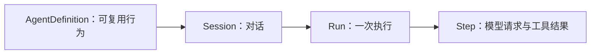
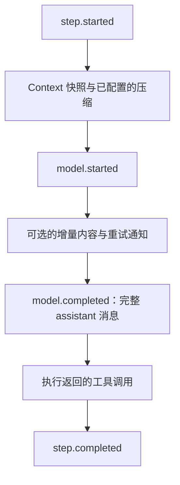

# Session、Run 与 Step

[English](../../en/concepts/session-run-step.md) | **简体中文**

一个 Agent 可以在同一对话中处理多次用户请求。May 分别命名对话、执行和模型步骤：



`AgentDefinition` 保存可复用行为，`AgentApplication` 管理一个 Session，
`AgentWorkspace` 选择活动应用。参阅
[Agent definition、Application 与 Workspace](agent-application.md)。各个包的职责见
[Runtime 与 Session 边界](../architecture/runtime-session.md)。

## Session

**Session** 是长期存在的对话身份，具有稳定的标识、可选的创建元数据、按序号排列的
事件历史和已经配置的 `May` 运行时。Run 结束后，Session 可以继续存在，
也可以通过新建的运行时恢复。

`Session.create()` 需要运行时，未提供 `SessionStore` 时使用内存存储。它拒绝在
非空历史上创建，并先追加 `session.created`。`Session.resume()` 要求历史存在且有效，
第一条也是唯一一条创建事件必须为 `session.created`。它回放模型可见消息，让调用方
重新创建运行时，并从最后一个已保存事件之后继续 Session 序号。

Session 元数据记录对话创建条件。恢复返回这些元数据，调用方仍需提供当前模型、
工具、指令、权限和 Context 实现。

### 提交串行化

`Session.submit()` 在前一个 Run 之后排队，返回的 Promise 在新 Run 启动时完成。
等待返回句柄的 `result`，才能确认执行结束。Run 被拒绝或失败后，后续提交仍可排队。

普通提交会先持久化 `input.submitted`，再让 Core 把用户消息追加到 Context。若取消
发生在存储写入期间，Session 会先启动 Core 再转发取消，使持久化回放和实时
Context 位于同一输入提交边界。提交前 `signal` 已取消的输入不会被记录。

`Session.continue()` 从现有 Context 开始，不增加输入事件。
`AgentApplication.retry()` 仅在确认最近持久化 Run 失败后使用它。

## Run

**Run** 是 Agent 循环的一次执行。`May.run()` 从用户消息开始，`May.continue()` 从
现有 Context 开始。二者都返回句柄：

```ts
interface RunHandle {
  readonly id: string;
  readonly events: AsyncIterable<MayEvent>;
  readonly result: Promise<RunResult>;
  cancel(reason?: string): void;
}
```

Run 在以下任一条件发生时结束：

- 模型返回不含工具调用的最终助手消息；
- 超过最大 Step 数或配置的运行预算；
- 宿主可选的 `shouldYield` 回调要求在完整 Step 结束后交还控制；
- 模型、Context、调度器、持久化或致命工具执行失败；
- `AbortSignal` 或 `cancel()` 取消执行。

`RunResult` 报告 Run 标识、已完成 Step 数、模型调用数、工具调用数、最终助手
消息，以及可用的 Provider 合计用量。交还控制的 Run 返回 `finishReason: "yielded"`，
后续执行由宿主安排。失败或取消时 `result` 会拒绝；
如果消费者需要观察终态，仍应消费或转发其事件。

一个 `May` 实例拥有可变 Context，Core 默认拒绝重叠 Run。`Session` 对提交排队；
`AgentApplication` 拒绝与当前活动操作冲突的新操作。

## Step

**Step** 是一次模型请求，加上执行返回助手消息中的全部工具调用：



若助手消息没有工具调用，同一个 Step 就完成 Run；若包含工具调用，其结果消息
追加到 Context，Run 继续下一个 Step。因此一个 Step 可以包含多个工具调用，`maxSteps`
限制模型与工具的迭代次数。

默认工具调度器串行执行，Core 提供可替换的 `ToolScheduler`。无论调度策略
如何，返回结果都必须与原始工具调用顺序一致。普通工具失败转成错误工具
消息，模型可在下一个 Step 恢复；致命工具失败会在记录结果后结束 Run。

## 取消与不完整工具调用

取消通过 `AbortSignal` 协作完成。工具执行期间取消时，Core 等待已启动操作结束，
为没有结果的调用创建取消结果，把完整工具消息集追加到 Context，在
`run.cancelled` 前发出可用结果。这样，工作对话中的助手工具调用都有对应结果。

恢复时，如果 Run 被取消，Session 也会检测没有持久化结果的助手工具调用，
并重建取消工具消息。该回放修复维持模型可见内容的一致性，临时进度仍只存在于
实时事件流。

## 身份与顺序

存在两个独立的序号范围：

- 每个 `MayEvent` 有 Run 内的 `runId` 与 `seq`，从 1 开始；
- 每个 `SessionEvent` 有 Session 内的 `sessionId` 与连续 `seq`，也从 1 开始。

Step 编号只在 Run 内有效。工具操作还通过 `ToolExecutionContext` 携带 Run 标识、Step、
工具调用标识和幂等键。

持久化连续性需要检查 Session 序号。背压下流式事件可能丢失，
读取历史时会校验 Session 序号连续。参阅[事件与持久化](events.md)。

## 哪些内容会持久化

Session 保存提交消息、完整助手消息、工具结果、审批、压缩检查点、
应用工具显示信息和 Run 边界。它不保存 Step 开始与完成、模型开始、流式
增量、模型重试通知、工具开始或工具进度。

Session 历史保存重建模型对话所需的事实。它与当前 Context
的关系见 [Context 与持久化历史](context-and-history.md)。

## Session 分支

`Session.branchPositions()` 返回已保存的请求边界。可用位置具有 `run.settled` 事件，
表示 Run 状态已经保存。`Session.fork()` 将选定位置的历史复制到新的 Session 身份，
并通过 `session.created.fork` 保存来源。

分支继承该位置的 Context、Provider 续接状态和运行时状态。应用状态仅复制明确
选择的键。权限记录和未交付输入被省略，已经交付的输入保留为对话内容。
`session.fork.ready` 表示初始化完成；初始化未完成的分支可以读取历史，无法恢复执行。

`AgentApplication` 恢复 Skills 和选定插件状态，`AgentWorkspace` 提供分支导航。
宿主管理的会话位置与文件版本关系见
[Git 工作区与文件检查点](../guides/git-workspaces.md)。

## 当前限制

一个 Session 使用一条串行 Run 事件流，每份历史要求一个活动写入者。
多个 Session 对象共同写入同一身份时，需要宿主或存储后端提供协调。
Core 和 Session 没有提供分布式写入协调。
