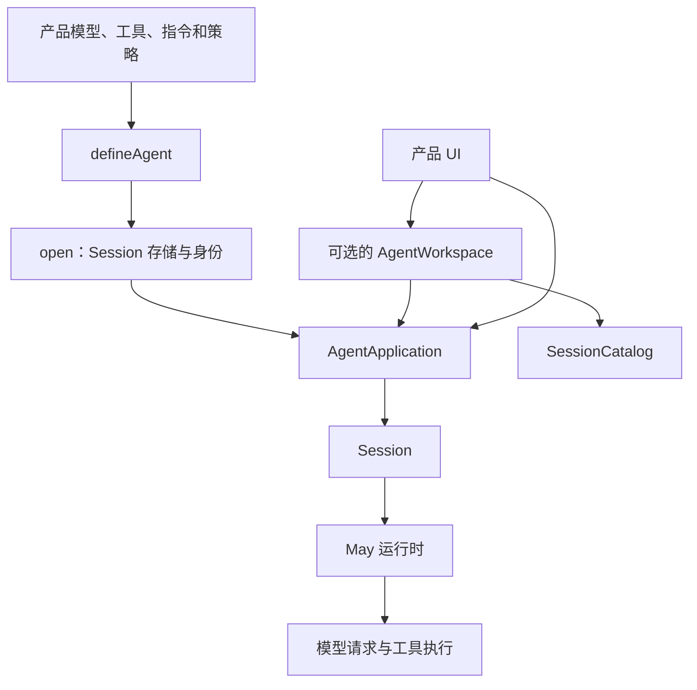

# 构建 Agent 应用

[English](../../en/guides/building-an-agent.md) | **简体中文**

本文指导应用组合模型、经过校验的工具、权限、受管理的 Context 和 Session 存储。
完成后得到可复用的 Agent 定义，产品可以独立于 UI 打开和关闭应用。

尚未运行 Agent 时先阅读[快速开始](../getting-started.md)。Agent definition、Session、
Run 和 Step 见 [Runtime 与 Session 边界](../architecture/runtime-session.md)。

`AgentDefinition` 和 `defineAgent()` 保存可复用行为，`ToolRegistry` 组合命名工具。
两者都接受 `Iterable<Tool>`，可以使用工具数组或注册表。

## 组合模型



依赖的重要规则是单向：`apps/` 下的可执行产品选择包，可复用包不导入产品。
MaybeCode 展示了一个产品如何组合这些包。

## 先选择生命周期层级

| 从这里开始 | 适用场景 | 需要自行负责 |
| --- | --- | --- |
| `@may/core` 的 `May` | 一次性、临时或深度嵌入式执行 | Run 上层的 Context 连续性、持久化、权限与关闭 |
| `@may/session` 的 `Session` | 需要持久化对话身份，并自行组装生命周期 | 运行时重建、权限事件持久化、发现和 UI 事件转发 |
| `@may/application` 的 `AgentDefinition` | 多个 Session 要复用同一套行为与策略 | 每次打开时提供存储、身份与元数据 |
| `@may/application` 的 `AgentApplication` | 独立于 UI 的产品需要一个活动、可恢复 Session | 产品模型、工具、指令、策略、存储和事件处理 |
| `@may/application` 的 `AgentWorkspace` | 用户需要创建、列出、恢复、重命名或删除 Session | Application 工厂、`SessionCatalog` 和产品配置迁移 |

多数交互产品用 `defineAgent()` 定义行为，再从中打开 Application。一次性或动态组合
可以直接调用 `AgentApplication.open()`。只需要执行循环时可以直接使用 Core。
`AgentApplication` 已经拥有一个 Session。

## 必需与可选输入

推荐把输入分成两个阶段。`defineAgent()` 必须提供：

- 一个 `Model`；
- 一个 `PermissionPolicy`。

`definition.open()` 必须提供一个 `SessionStore`，并可为本次 Session 提供 `sessionId`、
`resume`、`fork`、`metadata` 和 `contextMetadata`。Definition 选项会明确拒绝这些
对话相关输入，保持对话身份与可复用定义分别配置。

`fork: { sessionId, positionSeq }` 使用 `branchPositions()` 返回的可用位置创建独立
Session。Skills 激活状态来自选定位置。Definition 通过 `forkStateKeys` 和
`forkPluginIds` 声明需要继承的应用及插件状态，通过 `forkStateTransform` 调整资源
位置；审批授权、活动资源和未消费输入保持
独立。工作区工厂接收 `selection.fork`、`selection.workspace` 和可选的
`selection.metadata`，宿主使用这些信息重建指定目录的 Application。
`workspacePaths` 将相关 worktree 目录加入 Session 列表和分支树浏览范围。

定义阶段的可选设置如下：

- `tools` 默认不包含产品工具；
- `toolExecutor` 默认在权限检查后直接执行工具；
- `toolScheduler` 默认使用 Core 的串行调度器；
- 只有提供 `tracer` 才启用追踪；`traceAttributes` 为每个 Run 增加由调用方负责、
  不含内容的标签；
- `instructions` 默认没有系统指令；
- `contextFactory` 默认为 `InMemoryContextFactory`；
- 未配置时禁用 Context 容量预算与压缩；
- 只有同时提供 `sessionId` 与 `resume: true` 才恢复旧 Session；
- 只有 `sessionHistory` 是选项对象时才安装有界 `session_history` 工具；
- 只有产品提供 `createToolPresentation` 才生成工具显示元数据。

直接调用 `AgentApplication.open()` 仍受支持；此时以上两组输入放在同一个选项对象
中。一次性或高度动态的组合可使用该入口，复用行为时优先使用 Definition。

## 把组合集中在一个 Agent Definition

在按照[快速开始](../getting-started.md)配置的 ESM TypeScript 应用中创建 `agent.ts`。
以下工厂定义 Agent，由调用方传入真实模型适配器。后面的 Provider 和提交片段说明
其余应用操作。

仓库内应用需要以下 workspace 依赖：

```json
{
  "dependencies": {
    "@may/application": "workspace:*",
    "@may/context": "workspace:*",
    "@may/core": "workspace:*",
    "@may/session": "workspace:*"
  }
}
```

```ts
import { defineAgent, type AgentDefinition } from "@may/application";
import { InMemoryContextFactory, PruneOldToolResultsStrategy } from "@may/context";
import { ToolRegistry, type Model, type Tool } from "@may/core";

const lookup: Tool<{ key: string }, { value: string | null }> = {
  name: "lookup",
  description: "Look up a value in the product's read-only data source",
  inputSchema: {
    type: "object",
    properties: { key: { type: "string" } },
    required: ["key"],
    additionalProperties: false,
  },
  parse(input) {
    if (
      typeof input !== "object" || input === null ||
      !("key" in input) || typeof input.key !== "string"
    ) {
      throw new TypeError("key must be a string");
    }
    return { key: input.key };
  },
  async execute({ key }, context) {
    context.signal.throwIfAborted();
    return { value: key === "status" ? "ready" : null };
  },
};

export function createExampleAgent(model: Model): AgentDefinition {
  const prune = new PruneOldToolResultsStrategy({
    keepRecentToolResults: 4,
    minimumResultBytes: 2_048,
  });

  const tools = new ToolRegistry([lookup]);

  return defineAgent({
    model,
    tools,
    instructions: [
      "You are Example Agent.",
      "Use lookup when a requested value may exist in the data source.",
      "Do not invent missing values.",
    ].join("\n"),
    permissionPolicy: ({ tool }) =>
      tool.name === "lookup" ? "allow" : "deny",
    contextFactory: new InMemoryContextFactory(),
    contextBudget: {
      contextWindowTokens: 64_000,
      outputReserveTokens: 4_096,
      toolReserveTokens: 2_048,
      safetyMarginTokens: 1_024,
      compactTriggerRatio: 0.9,
    },
    compactionStrategy: prune,
    autoCompactionStrategies: [prune],
    sessionHistory: {
      maxEvents: 50,
      maxOutputBytes: 32 * 1_024,
      maxEventBytes: 8 * 1_024,
    },
    maxSteps: 16,
  });
}
```

在应用入口导入 `./agent.js` 的 `createExampleAgent`，并在下面的打开片段之前初始化
`model`、`store` 和 `workspace`。模型、[存储](custom-storage.md)和事件处理章节
说明这些操作及关闭要求：

```ts
const agent = createExampleAgent(model);
const application = await agent.open({
  store,
  metadata: { workspace, agent: "example" },
  contextMetadata: { workspace },
});
```

这个工厂返回产品实际的 Agent definition，所有影响行为的配置集中在同一个位置，
便于检查和测试。工具集合在 `defineAgent()` 返回前就被保存为快照；随后修改
`tools` 数组或注册表不会改变已有 Definition。64,000 token 容量只是示例值，
应使用所选 Provider 与模型的文档限制，并为输出和预期工具
数据保留足够空间。

每次 `agent.open(...)` 都创建独立的 `AgentApplication` 和 Session 生命周期。Definition
不会深拷贝模型、Context 工厂、工具调度器或其他有状态协作者；这些对象仍由
调用方拥有，并会在多次打开之间共享。若适配器不能安全共享，应为它创建独立
Definition 或包装工厂。

## 显式作出每个组合决策

### 模型与 Provider

Core 依赖与 Provider 无关的 `Model`。在产品边界选择一个具体适配器，并把它作为直接
依赖；凭据不能放入 Session 元数据或指令。

例如，DeepSeek 入口构造模型后调用工厂：

```ts
import { DeepSeekModel } from "@may/provider-deepseek";

const apiKey = process.env.DEEPSEEK_API_KEY;
const modelName = process.env.DEEPSEEK_MODEL;
if (!apiKey || !modelName) {
  throw new Error("Set DEEPSEEK_API_KEY and DEEPSEEK_MODEL");
}

const model = new DeepSeekModel({ apiKey, model: modelName });
```

这还需要 `"@may/provider-deepseek": "workspace:*"`。其他内置 Provider 包见
[配置参考](../reference/configuration.md)。适配器将输出标准化为 Core 事件，并
负责 Provider 请求格式、支持的内容、重试和原生续接状态。

### 指令

指令是产品策略，应描述 Agent 角色、边界、可用工作流程与输出要求，不能嵌入
凭据。

编码产品可用 `@may/coding-tools/instructions` 安全组合默认系统提示内容与有边界的
运行时及工作目录指令文件。通用产品可以自行加载或生成字符串。Session 恢复
时，应用使用**当前**产品配置提供的指令，历史保存此前的对话事实。

### 工具

Tool 提供一种能力、JSON Schema、可选解析器、执行与取消行为。
即使已提供 Schema，也应实现严格 `parse()`：解析器将 Provider 输出转换为已校验、
具有类型的值，并在运行时拒绝无效输入。

运行时内工具名必须唯一；`May` 和 `ToolRegistry` 用 `DuplicateToolNameError` 拒绝重复。
启用可选历史工具时，`AgentApplication` 保留 `session_history`。

数组适合固定的小集合；多个功能提供工具时，可用实例级注册表明确组合：

```ts
const tools = ToolRegistry.compose(filesystemTools, searchTools);
tools.register(reviewTool);

if (tools.has("review")) {
  console.log(tools.names());
}
```

`registerAll()` 会先校验整个输入；若任意工具无效，或名字与现有或同批工具重复，注册表
保持不变。`values()`、`definitions()` 返回按注册顺序排列的快照，`clone()` 创建可独立
继续注册的注册表，注册表自身也可直接迭代。详细 API 见[自定义工具](custom-tool.md)。
注册表由应用明确创建和传递，各个实例分别管理工具集合。

`May` 接受任意 `Iterable<Tool>` 并在构造时保存快照，之后修改源注册表不会改变正在
运行的运行时。`AgentDefinition` 同样在定义时保存工具快照；直接
`AgentApplication.open()` 在打开期间保存快照。源注册表的后续修改只影响之后重新
接收该注册表的消费者。

工具接收 `AbortSignal`，并可通过 `context.report(...)` 报告实时进度。I/O 和子进程
应响应取消。普通工具失败变成模型可见错误结果，致命错误只用于无法安全
继续的基础设施失败。

统一执行行为通过 Core `ToolExecutor` 接口提供。`AgentApplication` 接受 `toolExecutor`，
再用权限执行器包装它，因此可以通过该接口注入日志、沙盒调度或超时。
独立的 `toolScheduler` 决定同一 Step 中调用的调度方式；Application
会把它转发给 Core，Definition 会保存并复用该调度器。默认保持串行，只有工具和
协作者都能安全并发时才选择并行调度器。

### 权限决定与执行限制

`PermissionPolicy` 在工具输入解析后、执行前运行：

```ts
const permissionPolicy = ({ tool, input }) => {
  if (tool.name === "read") return "allow";
  if (tool.name === "write") {
    return {
      decision: "ask",
      grantKey: `write:${JSON.stringify(input)}`,
    };
  }
  return "deny";
};
```

`"allow-session"` 只适用于带 `grantKey` 的指定范围审批；授权保存在 Application 的
权限执行器中，关闭时消失。后续调用仍会重新评估策略，因此后续 `"deny"`
优先。

策略要求审批时，事件处理函数必须展示请求并调用：

```ts
await application.resolveApproval(requestId, "allow");
// 其他决定："allow-session" 或 "deny"。
```

审批只决定操作是否运行，不限制被允许的进程、网络请求或文件操作能影响什么。执行
不可信内容时，除权限之外还要在 Tool 或 `ToolExecutor` 边界提供受限执行后端。
`@may/coding-tools` 的 shell 使用宿主进程权限执行。

### Context 与压缩

Context 提供当前模型可见视图，Session 保存持久化历史。默认 `InMemoryContextFactory`
可通过控制器提供检查、手动和自动压缩。

以下内容要分别选择：

1. **容量预算：** 模型窗口减去输出、工具与安全预留容量。
2. **手动策略：** 显式 `application.compactContext()` 使用的 `compactionStrategy`。
3. **自动链：** 到达阈值时按顺序尝试的 `autoCompactionStrategies`。
4. **原生压缩：** 只有没有显式自动链时，`providerNativeAutoCompaction: true` 才加入
   模型适配器的原生压缩器。需要精确排序时，用
   `ModelContextCompactionStrategy` 包装并放入显式链。

框架会在继续之前把变化后的压缩视图持久化为 Session 事件，旧的持久化事实仍留在
历史中。Agent 需要找回从 Context 移除的详细内容时，启用有界 `session_history` 或提供
其他检索机制。

### Session 存储

按部署边界选择：

- `InMemorySessionStore`：确定性测试、演示或进程本地工作；
- `@may/session/file-store` 的 `FileSessionStore`：跨重启本地明文 JSONL；
- 产品实现的 `SessionStore`：数据库、加密、远程存储或更强并发要求。

内置文件存储假定每个 Session 一个活动写入者。没有在产品或后端增加控制时，不能
在其上承诺多进程或分布式协调。

Session 元数据只应包含恢复时用于校验的稳定、非敏感事实。用 `validateSession`
拒绝属于不兼容工作目录或产品的历史。模型、API key、可执行 Tool 对象和
Session 授权在运行时提供。持久权限规则使用独立配置的规则存储，见[权限策略](permission-policy.md)。

<a id="工具呈现-metadata"></a>

### 工具显示元数据

部分 UI 需要在请求审批前得到文件差异等信息。提供 `createToolPresentation(check)`，返回
带命名空间、版本且可序列化为 JSON 的元数据。`AgentApplication` 在权限评估前记录
它并实时发出 `tool.presentation`，Session 有意不把它加入模型可见对话。

产品定义 `kind`、`version` 和数据结构，应验证后解码持久化数据。编码产品可以复用
`@may/coding-tools/change-preview`。

### Observability 与 Tracing

可以直接提供 Core `Tracer`，也可以使用可选 `@may/observability` 包的
`BasicTracer`。Core 随后会创建不含内容的 Run、模型、Context、工具和权限
Span，并把 `TraceContext` 传播给模型及工具适配器。自定义属性必须保持有界，
不能放入提示内容、工具数据、凭据或其他敏感内容。

追踪失败不阻止 Agent 执行，追踪数据允许采样或丢弃，不能代替 Session 历史或
权限记录。创建处理器的产品负责最后的 `forceFlush()`/`shutdown()`；
Application 不会关闭可能共享的处理器。配置方法和 Span 名称见
[可观测性与 Tracing](observability.md)。

<a id="消费一个有序-application-stream"></a>

## 消费有序应用事件流

长生命周期 UI 通常在打开 Application 后立刻启动事件转发：

```ts
const relay = (async () => {
  for await (const event of application.events) {
    switch (event.type) {
      case "run.event":
        renderRunEvent(event.event);
        break;
      case "permission.event":
        await handlePermissionEvent(event.event);
        break;
      case "tool.presentation":
        renderToolPresentation(event.presentation);
        break;
      case "context.compacted":
      case "context.compaction.failed":
        renderContextNotice(event);
        break;
    }
  }
})();

try {
  const run = await application.submit({ input: "Inspect the current state" });
  const result = await run.result;
  renderFinalMessage(result.message);
} finally {
  await application.close();
  await relay;
}
```

这些渲染和处理函数由产品及 UI 实现。终端产品可以使用 `@may/tui`
Agent 对话视图，图形或远程客户端可以直接消费同一应用事件流。

处理实时事件时：

- 用 `runId` 关联 Run 事件，并按 `seq` 排序；
- 有界队列压力下容忍文本、推理、输出或进度增量缺口；
- 用 `run.result` 与 `application.history()` 获取权威最终数据；
- 可能出现审批时持续消费；
- 即使已渲染结束失败事件，也要处理被拒绝的 `result`。

每个 `AgentApplication` 只允许一个活动 Agent 操作。`cancel()` 取消活动 Run 或压缩；
只有最近 Run 失败时 `retry()` 才有效，并且不会追加重复用户消息。

<a id="单-session-还是-workspace"></a>

## 增加 Session 导航

产品一次只处理一个已知 Session 且在其他地方保存标识时，使用 `AgentApplication`。
需要发现与切换时加入 `AgentWorkspace`。

下列本地组合使用相同应用依赖，以及 `@may/session/catalog` 和
`@may/session/file-store` 导出路径：

```ts
import { AgentWorkspace } from "@may/application";
import { FileSessionCatalog } from "@may/session/catalog";
import { FileSessionStore } from "@may/session/file-store";
import { join } from "node:path";

const stateDirectory = join(process.cwd(), ".may");
const store = new FileSessionStore(join(stateDirectory, "sessions"));
const catalog = new FileSessionCatalog(join(stateDirectory, "catalog.json"));
const agent = createExampleAgent(model);

const workspace = await AgentWorkspace.open({
  workspace: process.cwd(),
  store,
  catalog,
  autoResume: true,
  openApplication: ({ sessionId, resume }) =>
    agent.open({
      store,
      metadata: { workspace: process.cwd(), agent: "example" },
      contextMetadata: { workspace: process.cwd() },
      ...(sessionId === undefined ? {} : { sessionId }),
      ...(resume ? { resume: true } : {}),
    }),
});

try {
  const run = await workspace.submit({ input: "Read the status value" });
  await run.result;

  const summaries = await workspace.listSessions();
  const newSessionId = await workspace.newSession();
  await workspace.resumeSession(summaries[0]?.id ?? newSessionId);
} finally {
  await workspace.close();
}
```

`SessionStore` 保存完整事件历史；`SessionCatalog` 是用于列出和选择的独立轻量
索引，Catalog 记录不会追加到模型 Context。内置文件 Catalog 保存基础 JSON
快照与追加式操作文件，并且不自动整理操作文件；维护步骤见[配置 Session 存储](custom-storage.md#本地存储维护)。

`AgentWorkspace` 串行化提交和 Session 变更，发出 `session.changed`，并更新 Catalog
摘要。改变模型或其他运行时配置的产品可以使用 `transitionApplication()` 在同一
Session 上打开替换 Application。模型配置选择等产品状态由产品管理。

## History、Context、Event 与 Catalog

四组数据各有用途：

| 数据 | 用途 | 持久化？ | 模型可见？ |
| --- | --- | --- | --- |
| 实时应用或 Core 事件 | 流式 UI、进度、审批协议 | 否；有界转发可能丢失增量 | 本身不可见 |
| Session 历史 | 有序最终事实与可恢复审计记录 | 是，由所选存储决定 | 回放事实重建 Context；显示元数据除外 |
| Context | 选择或压缩后的当前请求视图 | Application 记录替换检查点时保存 | 是 |
| Session Catalog | 标识、工作目录、标题、预览、时间戳等发现索引 | 由所选 Catalog 决定 | 否 |

UI 对话视图是投影，应从持久化历史重建，再应用实时事件。

<a id="关闭与-ownership"></a>

## 关闭与资源归属

拥有低层对象的组件负责关闭它们：

- `AgentDefinition` 没有活动资源或 `close()`；从中打开的每个 Application 都有自己的
  生命周期；
- Core `RunHandle` 可取消，`May` 本身没有关闭方法；
- `AgentApplication` 关闭活动 Run 或压缩、权限执行器和事件转发；
- `AgentWorkspace` 关闭活动 Application、串行状态队列、待处理 Catalog 记录和
  Workspace 事件流。

始终在 `finally` 中关闭。提交前启动长生命周期事件转发，关闭所属组件后再等待转发结束，
使其能观察事件流完成。由 Workspace 拥有的 Application 通过 Workspace 关闭。

## 验证应用

使用有效的 Provider 账号和所选模型的凭据运行应用，提交 `Read the status value`。
工具成功调用时返回 `{ value: "ready" }`，模型的最终表述可能变化。
确认 `close()` 后事件消费者结束。使用文件存储时，重新打开已保存的 Session 标识，
确认可以读取历史后接受新的输入。

### 实用构建清单

在把 Agent 产品视为完成前，确认它明确回答：

- **行为：** 哪些指令来自默认配置、运行时补充或工作目录控制的补充？
- **Definition：** 哪些配置跨 Session 复用，哪些输入只在 `open()` 时提供？Model、
  Context 工厂、执行器、调度器和策略闭包能否安全共享？
- **Provider：** 凭据从哪里加载，支持哪些模型限制和内容格式？
- **工具能力：** 工具注册表是否为实例级、没有重名，并在预期边界完成快照？输入
  是否解析，输出是否有限，取消是否转发？
- **外部工具：** MCP 服务端是否可信、带命名空间、采用最小权限、经过权限检查，
  并由拥有客户端池的组件关闭？
- **安全：** 哪些调用允许、拒绝或要求审批？审批之外有什么机制限制已允许工具？
- **Context：** 实际模型容量预算是多少，何时压缩，Agent 能否找回被省略历史？
- **持久化：** 使用内存、本地单个写入者，还是满足并发和加密要求的自定义后端？
- **事件：** 是否有持续消费者处理审批与结束失败，并使用完整消息确定最终数据？
- **可观测性：** 哪些 Trace 被采样和导出，属性是否不含内容，由哪个组件刷新数据
  并关闭处理器？
- **Session：** 如何发现标识、校验元数据、拒绝不兼容恢复？
- **生命周期：** 谁负责取消与 `close()`，包括启动或渲染失败时？
- **产品边界：** 其他 UI 或 Provider 能否复用独立于 UI 的应用组合？

<a id="相关-package-文档"></a>

## 相关包文档

- [`@may/core`](../../../packages/core/README.md)：执行循环、Tool/Model 接口、实时事件和
  执行器与调度器接口
- [`@may/application`](../../../packages/application/README.md)：独立于 UI 的单 Session 与
  Workspace 生命周期
- [`@may/context`](../../../packages/context/README.md)：检查、容量预算与压缩策略
- [`@may/session`](../../../packages/session/README.md)：持久化历史、恢复、文件存储
  与 Catalog
- [`@may/permissions`](../../../packages/permissions/README.md)：独立于 UI 的策略与审批协议
- [`@may/observability`](../../../packages/observability/README.md)：追踪、采样、
  处理器与导出器
- [`@may/mcp`](../../../packages/mcp/README.md)：stdio / Streamable HTTP MCP 客户端与远程工具适配器
- [`@may/coding-tools`](../../../packages/tools/coding-tools/README.md)：有界编码能力、
  指令、预览与 shell 安全边界
