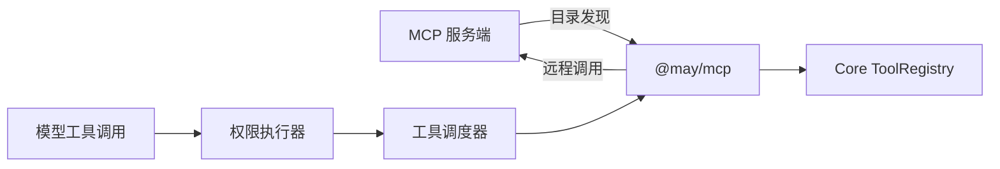

# 连接 MCP 服务端

[English](../../en/guides/mcp.md) | **简体中文**

本文用于在 MaybeCode 或使用 `@may/mcp` 的应用中配置 Model Context Protocol
（MCP）服务端。需要可信的 stdio 程序或 Streamable HTTP 端点、连接要求，以及所需
账户凭据。使用 MaybeCode 时，还需要已有的 May 配置和模型 profile。

1. 按照[MaybeCode 配置](#maybecode-配置)或[Package API](#package-api)添加端点。
2. 启动 MaybeCode 并执行 `/mcp`，或者在应用中读取 `pool.status()`。
   `connected` 表示连接和发现完成，可以检查发现的工具名称。
3. 通过应用通常的权限界面批准远程工具。
4. 退出时关闭应用及其连接池。

OAuth、长任务、图形 Apps 和服务端导出分别参阅[认证](mcp-auth.md)、
[Tasks](mcp-tasks.md)、[Apps](mcp-apps.md)和[服务端](mcp-server.md)。下文提供配置与
宿主操作参考；软件包与协议边界见[能力参考](../reference/mcp-capabilities.md)。

## 为什么使用独立 package

`@may/mcp` 管理目录发现、传输和子进程，将远程工具转换为 Core `Tool` 接口。
工具执行使用已有的权限、调度、取消、Session 和追踪服务。



应用通过创建连接池启用 MCP。仅使用本地工具的应用无需依赖 MCP package。

## Package API

在应用项目安装 `@may/mcp` 和 `@may/application`。以下集成片段假设已经创建
`model`、`localTools`、`permissionPolicy`、`tracer` 和 `store`。将
`mcp-server.mjs` 放在进程工作目录，或者使用绝对路径。服务端要求凭据时，
在打开连接池前验证凭据，并通过 `env` 提供。

```ts
import { defineAgent } from "@may/application";
import { openMcpClientPool } from "@may/mcp";

const mcp = await openMcpClientPool({
  servers: [{
    id: "workspace",
    command: "node",
    args: ["./mcp-server.mjs"],
    cwd: process.cwd(),
    required: false,
    requestTimeoutMs: 60_000,
  }],
  tracer,
});

try {
  const agent = defineAgent({
    model,
    tools: localTools,
    toolSource: () => mcp.tools,
    permissionPolicy,
    tracer,
  });
  const application = await agent.open({ store });
  try {
    console.log(mcp.status());
    const run = await application.submit({ input: "List the available project files." });
    await run.result;
  } finally {
    await application.close();
  }
} finally {
  await mcp.close();
}
```

打开连接池时，每个端点协商协议，并请求全部已声明的能力目录。`required` 默认
为 `true`；必需端点启动失败时，关闭已经打开的端点并拒绝启动。`required: false`
记录失败状态，允许其他端点继续启动。`close()` 可以重复调用，始终尝试关闭全部
连接，也负责终止 stdio 传输创建的子进程。

| 配置 | 含义和默认值 |
| --- | --- |
| `requestTimeoutMs` | 请求不活动超时，默认 60 秒；进度通知可以重置计时 |
| `maxTotalTimeoutMs` | 整个请求的绝对期限，包含持续进度和交互等待；默认未设置 |
| `maxBufferSize` | 单条 stdio 协议消息上限，默认 10 MiB |
| `stderrMaxBytes` | 保留的 stdio stderr 末尾片段，默认 16 KiB |

`pool.status()` 返回即时连接状态、协议版本、工具名称、目录版本、最新诊断和近期
stderr。`pool.events` 发布连接、目录更新、失败和断开事件。stderr 经处理后保留
在内存中，仍可能包含路径、token 或其他秘密，需要按敏感数据管理。

## 名称与冲突

模型可见的远程工具名称采用 `mcp__<server-id>__<remote-tool-name>`。
服务端 `id` 只接受字母、数字、`_` 和 `-`。远程名称中的其他字符转换为 `_`；
长名称加入确定性 hash，最终名称最多 64 个字符。任何剩余名称冲突使启动失败。

适配器保留远程 `inputSchema`，返回 MCP `content` 和可选 `structuredContent`。
协议或传输错误使用 `MCP_TOOL_CALL_FAILED`；结果中的 `isError: true` 使用
`MCP_TOOL_ERROR`，向调用方提供有长度限制的错误文本。Core 取消信号传给 SDK；
MCP 进度通知转换为 Core 工具进度事件。

## MaybeCode 配置

将以下片段加入启动 MaybeCode 时使用的 May 配置。示例需要工作区内的
`tools/mcp-server.mjs` 和启动进程中的 `MCP_ACCESS_TOKEN`；按服务端要求调整。
端点位于 `apps.maybecode.mcpServers`：

```json
{
  "apps": {
    "maybecode": {
      "mcpServers": {
        "workspace": {
          "transport": "stdio",
          "command": "node",
          "args": ["tools/mcp-server.mjs"],
          "cwd": ".",
          "required": false,
          "env": { "ACCESS_TOKEN": "${MCP_ACCESS_TOKEN}" },
          "requestTimeoutMs": 60000,
          "maxTotalTimeoutMs": 300000,
          "maxBufferSize": 10485760,
          "stderrMaxBytes": 16384
        },
        "temporarily_disabled": { "enabled": false }
      }
    }
  }
}
```

`transport` 默认为 `stdio`；`streamable-http` 选择 HTTP。`mcpServers` 缺失、
为 `false` 或空对象时禁用 MCP。相对 `cwd` 从当前编码工作区解析，省略时同样
使用该工作区。参数直接传给进程，不经过 shell。

环境变量可以通过 `${NAME}` 引用启动进程的环境。缺少引用的变量时启动失败。
解析后的值保存在内存中，不进入内置 trace。配置文件使用明文，因此凭据使用
环境引用。

MaybeCode 在打开工作区前启动 MCP，将工具加入 `ToolRegistry`，在 Agent 工作区
关闭后、遥测导出前关闭 MCP。默认编码权限策略要求审批全部 MCP 工具。
`allow-for-session` 由 Session 权限执行器限制范围。两个终端界面的 `/mcp`
显示状态、工具、启动错误和保留的 stderr；controller 事件也提供生命周期通知。

## Streamable HTTP 与协议模式

在 `mcpServers` 中添加以下端点；直接使用 package `servers` 数组时还需要 `id`：

```json
{
  "remote": {
    "transport": "streamable-http",
    "url": "https://mcp.example.com/mcp",
    "headers": { "Authorization": "Bearer ${MCP_REMOTE_TOKEN}" },
    "protocolMode": "auto",
    "requestTimeoutMs": 60000,
    "maxTotalTimeoutMs": 300000,
    "required": false
  }
}
```

该配置需要 `MCP_REMOTE_TOKEN` 和可用端点。Header 环境引用只在 MaybeCode 配置中
展开，直接 package 调用需要已经解析的字符串。缺少变量时，即使端点可选也拒绝
启动。静态 headers 与原生 OAuth 均受支持，OAuth 参阅[认证](mcp-auth.md)。工具
权限仍由应用检查。

HTTP 配置拒绝 `command`、`args`、`cwd`、`env`、`maxBufferSize` 和
`stderrMaxBytes`。Stdio 拒绝 `url` 和 `headers`。
`maxBufferSize` 限制 stdio 消息；宿主的网络层单独配置 HTTP 响应限制。

`protocolMode` 接受 `legacy` 与 `auto`。Stdio 默认 `legacy`；HTTP 默认 `auto`，
通过 `server/discover` 发现现代服务端，并在协议适用时使用 `initialize`。
Stdio `auto` 可能另外启动短期探测进程。Client SDK 为 2.0.0。本地集成覆盖
`2025-11-25` stdio/HTTP 和 `2026-07-28` HTTP 工具路径；第三方兼容性需要单独验证。

只接受 HTTPS，`localhost`、`127.0.0.1` 和 `[::1]` 可以使用 HTTP。URL 拒绝用户名、
密码和 fragment，凭据通过 headers 提供。所有重定向都会拒绝。Headers 拒绝重复
名称、非法值、`mcp-*` 和协议保留项：`Host`、`Connection`、`Content-Length`、
`Transfer-Encoding`、`Upgrade`、`Accept`、`Content-Type`、`Origin`、`Cookie`、
`Proxy-Authorization`。宿主负责可信端点和私有网络访问策略。

HTTP SDK 错误内容可能含有凭据，公开错误、状态和追踪只保留安全元数据及可用的
HTTP 状态码。工具 `isError` 的有限文本仍返回调用方，HTTP 错误 span 不记录该文本。
Span 不包含 HTTP headers 或 URL，HTTP 端点没有 stderr。

连接状态描述建立与发现结果。单次 HTTP 错误使当前操作失败，已发现工具仍保留。
没有自动重连、流恢复、通用工具重试或旧 HTTP+SSE 传输。关闭旧协议 HTTP session
时尝试 DELETE，最多五秒或较短的请求超时，随后始终释放本地资源。远端用户数据
保持不变；现代协议没有远端协议 session。

## Tracing 与安全

| Span | 含义 |
| --- | --- |
| `may.mcp.connect` | 建立传输和协商协议 |
| `may.mcp.tools.list` | 首次及刷新能力目录 |
| `may.mcp.tool.call` | 远程调用，父节点为 Core 工具 span |
| `may.mcp.disconnect` | 关闭连接和子进程 |

内置追踪记录端点身份、传输类型、工具名称、数量、状态和耗时，不记录命令参数、
环境值、请求输入、响应内容、提示词或模型消息。本地 stdio 程序拥有启动用户的
权限，还会提供模型可见的工具描述。需要检查服务端来源、限制其环境和文件访问，
并启用应用权限策略。

## 当前范围

连接池支持动态工具、资源与模板、提示模板、补全、资源订阅和有归属的用户交互。
Roots/Sampling、Tasks 和 Apps 需要明确宿主配置。独立服务端使用单独入口。
支持版本和能力限制见[能力参考](../reference/mcp-capabilities.md)。

## 动态目录与端点恢复

在 Agent 配置中使用 `toolSource: () => mcp.tools`，使每个 Run 读取当前工具目录。
直接将 `mcp.tools` 传入静态 `tools` 会固定当时的集合。MaybeCode 自动使用动态
来源。新目录影响下一次 Run 或继续执行；当前 Run 保留自己的快照。工具定义变化、
移除或目录失效时，旧快照通过 `MCP_STALE_TOOL` 拒绝发送请求。

| 操作 | 行为 |
| --- | --- |
| `mcp.catalog()` | 返回深度冻结的版本、能力、工具、资源、模板和提示模板元数据 |
| `mcp.refresh(serverId?, signal?)` | 重新获取已声明目录；省略 `serverId` 时刷新全部端点 |
| `mcp.reconnect(serverId, signal?)` | 关闭并替换一个端点，包括启动失败的可选端点 |

刷新只发布完整候选目录：每个列表最多 64 页，重复游标或身份使刷新失败，全部
列表合计最多 4,096 项、8 MiB。期限为 `maxTotalTimeoutMs`，未配置时为 60 秒。
仅查询服务端声明的能力，也支持只提供资源的端点；目录元数据不授予内容读取权限。

目录变更通知立即使工具失效，并合并执行刷新。现代协议使用 `subscriptions/listen`，
旧协议使用通知 handler。刷新期间连续变化最多尝试三次；失败保留旧目录并标记
过期，新 Run 不再取得其工具。存在执行中的工具调用时，重连拒绝执行。

终端命令 `/mcp refresh [server-id]` 和 `/mcp reconnect <server-id>` 提供明确操作。
`/mcp` 显示目录版本、过期状态和通知覆盖状态：`active`、`partial`、`unavailable`、
`legacy`、`not-advertised`。订阅断开报告失败。`mcp.server.catalog-updated` 表示
新目录已经发布。

工具授权身份包含完整定义、端点与账户配置、连接代次，凭据内容保持私有。定义
不变的刷新保留授权，重连创建新身份。OAuth 登录后执行重连，然后启动新 Run。
目录与缓存归连接管理；关闭取消目录发现和订阅。

## 资源、提示词、补全与附件

`readResource`、`readResourceTemplate`、`getPrompt`、`complete` 和
`subscribeResource` 是宿主操作。应用根据已授权用户意图或明确宿主策略调用，
检查访问权限，并传入取消信号和追踪上下文。

以下片段需要已经打开的 `mcp` 和操作 `signal`。URI、模板及提示模板名称需要取自
`mcp.catalog()`：

```ts
const read = await mcp.readResource("workspace", "project:///README", { signal });
const expanded = await mcp.readResourceTemplate(
  "workspace", "project:///{path}", { path: "README" }, { signal },
);
const prompt = await mcp.getPrompt("workspace", "review", { file: "main.ts" }, { signal });
const suggestions = await mcp.complete("workspace", {
  ref: { type: "ref/prompt", name: "review" },
  argument: { name: "file", value: "ma" },
}, { signal });
const watch = await mcp.subscribeResource("workspace", read.uri, { signal });
// watch.events 提供更新通知；需要内容时明确重新读取。
await watch.close(); // watch.closed 也报告远端或连接关闭。
```

两个终端界面支持以下命令。JSON 直接输入，内部空白保留，无需 shell 引号：

```text
/mcp catalog [server-id]
/mcp read server-id resource-uri
/mcp template server-id uri-template {"path":"README"}
/mcp prompt server-id prompt-name {"file":"main.ts"}
/mcp complete server-id {"ref":{"type":"ref/prompt","name":"review"},"argument":{"name":"file","value":"ma"}}
/mcp attach server-id resource-uri 这个资源包含什么？
/mcp use-prompt server-id prompt-name {"file":"main.ts"}
/mcp watch server-id resource-uri
/mcp unwatch server-id resource-uri
```

`read`、`template` 和 `prompt` 提供预览；`attach` 和 `use-prompt` 明确以用户消息
启动 Run。准备与提交使用同一 Session 状态队列，Ctrl+C 或关闭会取消准备。
`mcpResourceToUserMessage` 和 `mcpPromptToUserMessage` 保留 MCP 来源。远端角色
标签和资源链接作为数据呈现；不会下载链接、读取本地文件或追加任意角色历史。
订阅通知不会改变模型 Context。

| 项目 | 限制 |
| --- | --- |
| 内容结果 | 128 个内容块、8 MiB；验证 base64 和 MIME |
| 终端预览 | 16,000 字符，二进制显示标签 |
| 补全 | 每次 100 项、64 KiB，每连接每秒十次 |
| 资源缓存 | 每连接 32 项、16 MiB，正 TTL 最多五分钟，缺少 TTL 不复用 |
| 资源订阅 | 每连接 64 个 handle，每个 handle 缓冲 32 条通知 |
| HTTP JSON 和 SSE frame | SDK 解析前限制为 10 MiB |

超限内容拒绝返回。媒体转换为 provider 无关的 base64 内容，模型不支持时抛出
`UnsupportedContentError`。`Tool.resultContent` 生成模型内容，原始工具事件保留
原结果，`_meta` 仅供宿主使用。终端按 Enter 发起补全，图形界面需要控制输入请求频率。

`cache: "refresh"` 重新读取；`"bypass"` 不使用或写入缓存。通知使缓存失效，读取
期间收到更新不会写入过期内容。缓存隔离端点、账户、连接以及交互操作的工作区
和 Session。命中前与读取后检查 OAuth 授权代次，授权变化后需要重连。

现代订阅使用 `subscriptions/listen`，旧协议使用 subscribe/unsubscribe。同一 URI
共享远程流，各 handle 独立取消。流断开结束 `closed`，需要明确重新建立订阅。
连接关闭释放全部 handle。Stdio 保留可配置消息上限及有序通知交付。

## 有作用域的用户交互（现代 MRTR）

现代 `tools/call`、`resources/read` 和 `prompts/get` 可以暂停并请求表单或 URL
交互。宿主将续接绑定到原始逻辑请求，SDK 管理新的请求 ID 和不透明 `requestState`。
结果未知的工具调用需要调查，随后决定是否启动新的操作。

MaybeCode 两个终端界面显示服务端和 Session，允许编辑 JSON 表单，使用独立的
`send` 确认发送，也支持 `decline` 和 `cancel`。表单答案不加入输入历史，表单中
不得输入凭据。URL 模式显示 HTTPS 主机与完整地址，用户同意后自行访问，再通过
`retry` 继续。客户端不会获取地址、打开浏览器或转发 MCP 凭据。外部访问是否完成
由用户检查，客户端 OAuth 登录使用独立流程。

自定义宿主为每个连接池建立一个 broker，并发消费事件。以下片段假设已经配置
`servers`、可信 `workspaceIdentity`、`sessionId` 和操作 `signal`。宿主需要实现
事件消费界面，并使用用户审阅后的答案调用 `interactions.respond()`：

```ts
import { McpInteractionBroker, openMcpClientPool } from "@may/mcp";
const interactions = new McpInteractionBroker();
const pool = await openMcpClientPool({ servers, interactions });
const owner = { workspaceId: workspaceIdentity, sessionId };
// 并发消费 interactions.events，验证归属并取得用户审阅结果。
// 使用 interactions.respond(request.id, request.owner, userReviewedResponse) 回答。
const read = await pool.readResource("remote", "project:///README", { owner, signal });
await pool.close(); // 同时关闭由 pool 管理的 broker。
```

Broker 使用一个 UI 消费者。事件流是有界的，可通过 `list(owner)` 查询当前待答项。
没有 UI 时省略 broker；此时不声明交互能力，输入请求拒绝执行。库入口
`openConfiguredMaybeCode` 默认没有 broker；能够消费并回答 controller 事件时，
设置 `mcpInteractions: true`。交互 CLI 自动启用。

`MayOptions.toolScope()` 提供可信字符串标签，Core 每次 Run 创建快照，放入
`ToolExecutionContext.scope`。`AgentApplication` 提供自身 `sessionId`，MaybeCode
提供已解析工作区的 `workspaceId`。直接执行连接池工具时，调用方负责这两个标签。
适配器补充 Run、工具调用和逻辑请求 ID；归属标签保持在宿主内部。其他操作通过
`McpOperationOptions.owner` 提供归属。缺少可信归属时无法发起交互。

产品 UI 消费 `mcp.interaction.requested` 和 `settled`，通过 `getMcpInteractions()`
查询、`respondMcpInteraction(id, response)` 回答。答案通过 Session 队列之外的
通道处理，使资源准备能够取得答案。操作期间固定 Session，取消后释放等待中的
Session 变更。对话框临时保存，能够独立取消。

交互限制为八轮续接、每个逻辑流程 32 个输入请求、每个池 32 个待答项、每个表单
32 个字段、请求与响应各 64 KiB、说明文字 4,096 字符。表单支持基本类型和单选或
多选枚举，拒绝不支持的 schema、外部引用及任意正则表达式。响应不强制转换类型、
不自动填写默认值，额外字段会被拒绝。

`requestTimeoutMs` 保持请求超时语义，进度能够重置计时。设置 `maxTotalTimeoutMs`
后增加绝对期限，包含 UI 等待。每次交互从到达开始计时，未配置时为 60 秒，并受
绝对期限限制。取消、过期和关闭移除待答项，拒绝迟到、重复或归属错误的答案。
续接前重新检查认证代次和目录有效性。Broker 不独立保存或追踪答案；服务端仍可能
将已提交的数据作为工具或资源结果返回。

## Roots、Sampling 与旧协议兼容

Roots 与 Sampling 默认关闭。MCP `2026-07-28` 已将它们标记为 deprecated。
新集成可以直接使用模型 provider API。启用兼容服务后，Session 历史及本地工具
权限仍由应用管理。

在 MaybeCode 服务端配置中合并以下字段：

```json
{
  "host": {
    "roots": true,
    "sampling": true,
    "legacyRequests": "isolated"
  }
}
```

需要活动 broker 和 UI。直接 package 使用 `hostServices: McpHostServices` 提供
`roots(context)` 和 `sampling.createMessage(params, context)`。有 broker 但缺少
已开启的服务时配置失败；没有 broker 时不声明宿主能力。回调取得可信归属、逻辑
请求 ID、期限和取消信号；自定义服务需要校验归属。

- **Roots**：MaybeCode 提供当前工作区。宿主规范化并去重可访问的本地 `file:`
  路径，取得只读审阅同意后发送，拒绝时返回空列表。最多 32 项、64 KiB，同意后
  再检查可访问性。Roots 提供工作区信息，工具负责文件权限。不声明
  `roots.listChanged`，每次重新取得候选目录。
- **Sampling**：用户审阅输入，provider 调用完成后再次审阅输出，决定是否发送。
  输出拒绝无法撤销已经产生的费用。请求和结果各限 48 KiB、64 条消息、32 个工具；
  每次最多 4,096 输出 token，每个逻辑流程最多四次调用和 16,384 个预留输出 token。
  `includeContext` 只接受 `none`。
- `createMcpModelSampler(factory)` 创建独立的 provider 无关 `Model` 请求。
  factory 接收已批准 `maxTokens`，需要在 provider 层执行，并声明不超过该值的
  正数 `limits.maxOutputTokens`。MaybeCode 依据当前 profile 创建独立基础 provider，
  同时覆盖 `maxTokens` 和 `maxOutputTokens`。模型、temperature、stop 和请求
  metadata 采用宿主配置。
- Sampling 发送服务端工具定义及转换后的工具历史，不执行本地工具。支持的文本、
  内联图片和音频具有大小限制。不支持的输出拒绝返回；URL 和文件不会获取。
  Reasoning、模型状态和结果 `_meta` 不发送。自定义 sampling 服务可以省略
  `supportsTools`。

每次披露前检查认证与目录。取消或过期停止等待，迟到回调结果被丢弃。文件系统与
provider 错误经过处理后返回服务端。自定义回调需要响应取消及预算；任意 JavaScript
或已经发送的远程模型请求无法通过取消本地等待强制终止。

`legacyRequests: "isolated"` 为每次旧版工具调用、资源读取或提示模板获取创建新的
stdio 进程或 HTTP 连接/session，每端点最多八个并发子连接。发送前检查子连接协议
和完整目录与父连接一致，交互期间继续检查有效性。通道绑定一个可信归属，完成、
取消或池关闭后释放。操作之间不保留进程/session 状态，需要服务端支持独立会话。
命中资源缓存仍可能产生子连接发现请求。共享旧协议连接的无归属启动请求会拒绝
表单交互、返回空 Roots，并拒绝 Sampling。

现代 Tasks 通过 `tasks: true` 和 journal 启用，参阅[长任务](mcp-tasks.md)。
图形集成参阅[隔离 Apps](mcp-apps.md)。独立的认证工具、资源和提示模板导出使用
`@may/mcp/server`，参阅[服务端编写](mcp-server.md)。

## 故障检查

| 现象 | 检查与处理 |
| --- | --- |
| 连接前启动失败 | 检查环境引用、传输专用字段、命令路径及必需端点诊断 |
| `auth-required` | 完成 [OAuth 登录](mcp-auth.md)，重连后启动新 Run |
| `MCP_STALE_TOOL` | 刷新或重连，再通过当前目录启动新 Run |
| 资源订阅结束 | 检查 `watch.closed` 和端点状态，明确刷新或重连后创建新订阅 |
| 交互过期 | 检查 UI 是否并发消费事件，以及请求期限是否允许用户审阅；重新发起授权操作 |
| 远程调用结果未知 | 核查远程效果后决定是否发起新调用，参阅[恢复](recovery.md) |
