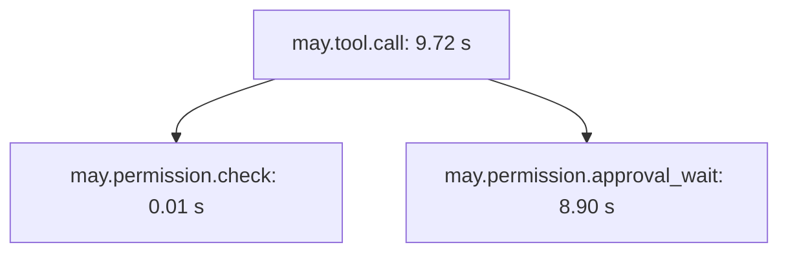

# 配置可观测性与 Tracing

[English](../../en/guides/observability.md) | **简体中文**

本文用于记录 Run 耗时、用量、指标和诊断。需要已有 May 应用，以及本地文件、
控制台或 OTLP 导出目标。`@may/observability` 提供追踪与诊断实现，
`@may/plugin-observability` 可以通过 Application 插件管理相关资源。

完整的配置式示例参阅[模型验证与执行诊断](model-telemetry-integration.md)。
下文提供直接 tracer 配置和遥测数据参考。

## 事件、历史与 Trace

- `MayEvent` 和 `AgentApplicationEvent` 用于实时呈现与生命周期观察；
- `SessionEvent` 以追加方式保存，用于恢复和历史查询；
- Trace 是可采样的运行数据，允许缓冲或丢弃，不能作为 Session 或权限状态的事实来源。

一个 `may.run` span 表示一次 Run。Model、Context、工具批次和工具调用 span 是它的
子节点；Permission span 是对应工具调用的子节点。Session 会给 Run 添加
`may.session.id`；同一 Session 中的不同 Run 仍是不同 Trace。

## 配置 Tracer

Core 导出 `Tracer`、`TraceSpan`、`TraceContext`、属性类型和受保护的遥测调用方法。
在使用项目安装 `@may/application` 和 `@may/observability`。以下集成片段假设
已经配置 `model`、`tools`、`permissionPolicy` 和 `store`。

```ts
import { defineAgent } from "@may/application";
import {
  BasicTracer,
  BatchSpanProcessor,
  ConsoleSpanExporter,
  ratioSampler,
} from "@may/observability";

const processor = new BatchSpanProcessor(
  new ConsoleSpanExporter(),
  {
    maxQueueSize: 2_048,
    maxExportBatchSize: 256,
    scheduledDelayMs: 2_000,
  },
);

const tracer = new BasicTracer({
  processor,
  sampler: ratioSampler(0.1),
  resourceAttributes: { "service.name": "example-agent" },
});

const definition = defineAgent({
  model,
  tools,
  permissionPolicy,
  tracer,
  traceAttributes: { "may.agent.name": "example" },
});

try {
  const application = await definition.open({ store });
  try {
    const run = await application.submit({ input: "Inspect the project" });
    console.log(run.traceContext?.traceId);
    await run.result;
  } finally {
    await application.close();
  }
} finally {
  // 所有共享该 processor 的应用关闭后，释放导出资源。
  await processor.shutdown();
}
```

`AgentDefinition` 保存调用方管理的 tracer，并复制 `traceAttributes` 的顶层字段。
每次 Run 可以增加不含正文的属性，或提供明确父级 `traceContext`。
`ModelStreamOptions`、`ToolExecutionContext`、`RunHandle` 和 `AgentRun` 会暴露传播后的
trace context，供 provider、远程工具或上层操作继续建立子 span。

## 内置 Span

| Span | 作用 |
| --- | --- |
| `may.application.open` | 创建/恢复并校验一个 application Session |
| `may.run` | Core Run 根节点、结果、调用数和聚合 token usage |
| `may.context.snapshot` | 准备模型可见的 Context snapshot |
| `may.context.append` | 追加输入、assistant 或工具结果 message |
| `may.model.call` | 一次模型 stream、usage、工具调用数和 retry event |
| `may.tools.batch` | 调度一次模型响应产生的工具调用 |
| `may.tool.call` | 解析、授权并执行一个 Tool |
| `may.permission.check` | 执行 permission policy |
| `may.permission.approval_wait` | 等待显式审批决定 |
| `may.context.compact` | Application 显式请求的 Context 压缩 |

以下示例数值说明审批等待如何计入工具耗时：



这样可以把用户审批等待与剩余的工具执行时间区分开。Model span 中的
`may.model.retry` event 同样可以把 provider retry 延迟与 Context 准备、工具耗时分开。

## Processor、Exporter 与采样

- `InMemorySpanProcessor` 保存完成的 span，用于测试和本地检查；
- `SimpleSpanProcessor` 异步串行调用 exporter；
- `BatchSpanProcessor` 使用有界队列并暴露 `droppedSpans`，不会把 exporter backpressure
  施加给 Run；
- 内置 `InMemorySpanExporter` 和 `ConsoleSpanExporter`；
- `JsonlFileSpanExporter` 会把 append 串行写入本地 JSONL 文件，并可按本地日历日期
  轮转及限制保留窗口；
- `alwaysOnSampler`、`alwaysOffSampler` 和 `ratioSampler()` 决定根 Trace 是否采样，
  子 span 继承父节点决定。

Processor 拥有异步导出和生命周期。需要等待已排队 span 时调用 `forceFlush()`；只在真正
owner 结束时调用一次 `shutdown()`。关闭一个 application 不得关闭仍被其他 application
共享的 processor。

`BatchSpanProcessor` 通过 `onError` 报告 exporter 的同步及异步错误，释放失败的批次，
并继续导出后续批次。排队的导出尝试结束后，`forceFlush()` 和 `shutdown()` 完成。

外部 tracing 系统应通过自定义 `SpanExporter` 或 `SpanProcessor` 集成，provider SDK
类型不能进入 Core。

## 在 MaybeCode 中启用 Tracing

在启动 MaybeCode 使用的 May 配置中加入以下字段，随后启动工作区。首次导出
span 时创建带日期的文件：

```json
{
  "apps": {
    "maybecode": {
      "observability": {
        "enabled": true,
        "exporter": "file",
        "file": "traces/traces.jsonl",
        "samplingRatio": 1,
        "retentionDays": 60
      }
    }
  }
}
```

启用后，工作区打开或重建的全部应用共享 tracer 和批次 processor，整个工作区
关闭后完成导出。`file` 是基础路径，本地日期插入扩展名之前。相对路径基于
MaybeCode 数据目录，默认文件为
`~/.may/maybecode/traces/traces-YYYY-MM-DD.jsonl`。

除非用 `retentionDays` 覆盖，MaybeCode 默认保留包括今天在内的最近 60 个本地日历日。
每天首次导出时，只会删除早于窗口且匹配已配置基础文件名与日期格式的文件，不会处理
无关文件。

没有 `observability` 配置，或配置为 `false`/`enabled: false` 时，MaybeCode 行为不变，
也不会创建 trace 文件。Batch 设置见[配置参考](../reference/configuration.md)。

## 隐私与失败行为

内置追踪只记录名称、ID、数量、耗时、状态、token 用量、权限决定及不含正文的
错误类型与错误码。提示词、消息、reasoning、工具输入输出和凭据不进入内置追踪。
调用方提供的 `traceAttributes` 不应包含秘密、大型内容或没有长度限制的用户输入。

Core 保护注入的 tracer/span 调用；内置 processor 捕获 exporter 错误，并可
通过 `onError` 报告。因此遥测后端故障不会使 Agent 工作失败或取消。Tracing 提供
运行诊断，导出具有数量限制并支持采样。宿主独立保存审计和权限记录，明确其保留期限
与送达要求。

## 独立指标与本地诊断

将这些对象加入前面的直接 tracer 配置。以下片段需要已经导入的 `BasicTracer`、
`ratioSampler`、现有 `processor` 和 Session 身份 `sessionId`。
在操作完成后读取快照。

```ts
import { BoundedMetrics, DiagnosticsStore } from "@may/observability";

const metrics = new BoundedMetrics({ maxSeries: 1_024 });
const diagnostics = new DiagnosticsStore({ maxSpans: 2_048, maxActiveSpans: 512 });
const tracer = new BasicTracer({
  processor, metrics, observer: diagnostics, sampler: ratioSampler(0.1),
});
const page = diagnostics.getDiagnostics({ sessionId, limit: 100, offset: 0 });
const snapshot = metrics.getMetrics();
```

生命周期通知和指标包含所有本地操作，包括未采样的 span。采样决定需要导出的 span。
正在执行的数量在开始时增加，在结束时减少一次。
内置指标提供数量、状态、耗时、首次输出时间、重试次数、实际测量的重试等待、token 明细、
费用、缺失数据以及 processor 的队列和导出状态。指标标签使用明确的允许列表，
费用计数同时保留 `currency`、`cost_kind`、`cost_complete` 标签。
Session、Run、任务、用户和 Trace ID 保存在 Trace 中。
默认最多保存 1,024 个标签组合，`droppedSeries` 报告超过限制的数量。
Histogram 快照包含累计区间数量、记录数量和总和。
宿主可以通过 `Tracer.recordMetric` 添加队列指标。

`DiagnosticsStore` 默认保留 2,048 个完成 span、512 个未完成 span 和一小时本地记录。
按照 `traceId`、`taskId`、`coordinationId`、`sessionId`、`runId` 查询，每页最多 500 条。
结果提供 `evictedSpans`、`coverage`、`total`、`hasMore`；span 包含 `ended`、`sampled`、
父节点身份、时间、用量、费用和不含正文的错误信息，并继承本地父 span 的关联信息。
并行操作需要分别显示耗时，任务经过的时间通过任务开始和结束时间计算。

## 模型调用与请求尝试

`may.model.call` 表示包含重试与等待的逻辑调用；其子 span `may.model.attempt`
表示每次请求尝试，分别记录状态、耗时、完成情况和用量是否可用。
已知无效请求在 `Model.preflight` 中被拒绝，逻辑调用记录错误，物理尝试数量为零。
`modelCallId` 在重试期间保持一致，每次尝试具有独立的 `may.model.attempt_id`。
`RetryingModel` 通过 `ModelStreamOptions.attemptObserver` 报告尝试；May 为普通
adapter 报告一次尝试。Model wrapper 必须保留 `reportsAttempts` 并传递 observer。
`attemptObserver.retryWait` 报告实际等待时间，取消期间已经等待的时间也会记录。
`may.model.retry_wait_ms` 保存逻辑调用中的累计等待时间。

`may.model.first_content_ms` 表示首次非空 text/reasoning delta、工具响应或完整响应中
非文本内容出现的时间；`may.model.first_text_ms` 表示首次非空可显示文本出现的时间。
逻辑调用的时间包含重试等待；尝试的时间从该次请求开始计算。
没有对应输出时保持未提供状态。取消、协议错误、成功的空响应和只有工具调用的响应
分别保留结果与 `has_content`/`has_text`。每次尝试报告用量是否可用。
provider 没有提供失败尝试的用量时记录明确的缺失状态。

调用信息包含 adapter/model 配置、能力版本、缓存/reasoning token 明细和预算使用的
同一个计价结果。费用包含币种、估算或 provider 金额、完整性和价格身份/版本。
读取金额时需要同时读取完整性状态。

用量完整性通过 `resolveUsageTotals` 计算，与 Run 预算保持一致。
provider 完成的响应未通过 JSON/Schema 校验时，已知 Usage 与费用继续保留；
请求尝试和逻辑调用记录错误，并保留 `may.model.completed=true`。
May 在保存 Context 和执行完成 Hook 之前记录一次用量与计价结果。
final `modelEvent` Hook 失败时也会保留已收到的用量；未通过校验的响应不会追加到
Context，也不会产生成功完成事件。失败 Run 的 span 提供预算累计 token、费用和
完整性。预算或计价失败时，原始响应校验原因和已知 token 数量继续保留。
Token 与费用指标仅在逻辑调用结束时记录一次。

## OpenTelemetry 与 OTLP

`OpenTelemetryTracer` 接入宿主管理的 OpenTelemetry API tracer，并显式传递父节点。
`OpenTelemetryMetricRecorder` 独立于 Trace 采样记录 meter 指标并限制标签组合数量。
以下接口使用官方 SDK 和 HTTP/JSON exporter，独立管理 provider：

以下片段需要两个地址上的 OTLP HTTP collector，以及前面创建的 `diagnostics`。
应用使用 `telemetry.tracer`，全部关闭后再释放遥测资源。

```ts
import { createOtlpTelemetry } from "@may/observability";

const telemetry = createOtlpTelemetry({
  serviceName: "example-agent",
  tracesUrl: "http://localhost:4318/v1/traces",
  metricsUrl: "http://localhost:4318/v1/metrics",
  timeoutMs: 5_000, maxQueueSize: 2_048, maxExportBatchSize: 256,
  samplingRatio: 0.1, observer: diagnostics,
});
// Application 使用 telemetry.tracer，全部关闭后释放 SDK。
await telemetry.forceFlush();
console.log(telemetry.getDiagnostics());
await telemetry.shutdown();
```

两个 HTTP endpoint 都需要明确提供。认证 `headers` 单独用于连接。
队列数量、批次数量、导出并发、超时、指标标签组合和生命周期等待均有明确限制。
生命周期完成前处理 Trace 和指标两类操作的结果，导出及生命周期失败通过 `onError`
和诊断计数报告。`shutdown()` 可以重复调用。
已有 SDK 的宿主使用直接 adapter，继续管理自己的 provider。

## 任务关联与验收

Core 的版本化 `TelemetryCorrelation` 验证父节点身份与任务、协调、派发、调度和恢复
来源 Run ID。宿主与远程执行一同传递，并使用 `correlationTraceAttributes` 转换属性。
恢复执行创建新的身份，通过 `resumedFromRunId` 关联原来的 Run。
接收关联信息后必须在执行前验证。本地诊断保存当前进程观察到的操作。

以下片段需要 `DiagnosticsStore` 和独立取得的验证证据。验收器完成后记录结果，
将身份、版本和引用替换为实际值。

```ts
diagnostics.recordAssessment({
  taskId: "task-123", sessionId: "session-123", coordinationId: "coordination-123",
  evaluator: "file-checks", evaluatorVersion: "2",
  result: "passed", configurationVersion: "context-policy-3",
  evidenceReferences: ["artifact:checks-123"],
});
```

验收结果包括 `passed`、`failed`、`inconclusive`，记录验收器版本、配置版本、时间和
证据引用。宿主负责证据的存储和访问权限。
默认保存最多 256 条验收记录，每条记录最多包含 16 个引用，每个引用最多 256 个字符。

验收范围支持 `sessionId`、`runId`、`coordinationId`、`traceId`。记录验收结果时，
缺失字段仅根据当时保留的任务 span 中唯一的身份推断。有范围条件的查询严格匹配
已经保存的字段；身份存在歧义的记录仅通过独立 `taskId` 查询访问。
保存的验收范围在 span 超过保留上限之后继续有效。任务名称可能重复时，
提供 Session 或协调任务的身份。

## 数量限制与导出诊断

属性接受有限数值、字符串、boolean 和有数量限制的数组。默认最多 64 项属性，
每个字符串最多 256 个字符，每个数组最多 16 项，保留最多 64 条 event。
内容和凭据属性名称会被拒绝，宿主负责允许属性的具体含义。
`InMemorySpanProcessor` 和 `InMemorySpanExporter` 默认保存 2,048 个 span，
支持配置上限并提供 `droppedSpans`。
`SimpleSpanProcessor` 使用相同的有界处理机制，每个批次包含一个 span。
`BatchSpanProcessor` 可以通过 `metrics` 保存队列长度、丢弃和失败数量，
`getDiagnostics()` 提供队列长度、导出状态、丢弃数量、失败数量、超时数量和关闭状态。
导出和关闭等待默认限制为五秒。普通失败释放该批次，后续批次继续执行；导出超时
关闭 processor 并丢弃剩余队列，限制无法结束的导出操作数量。
调用 `shutdown()` 释放 exporter 资源。

## 验证

启用遥测后，执行真实应用操作，检查 Run 和子节点身份、Session 查询、用量完整性
及清理。通过 `droppedSpans`、`coverage` 和队列诊断，判断查询是否覆盖已经保留
的全部证据。

在仓库根目录执行 `pnpm --filter @may/observability test`，检查本地 processor、
指标、诊断与 OpenTelemetry 集成。外部 collector 送达和 provider 用量需要单独
配置对应服务。
