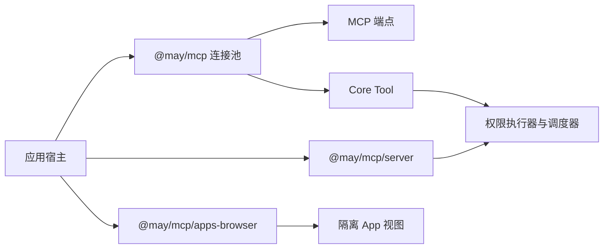

# MCP Host 能力与边界

[English](../../en/reference/mcp-capabilities.md) | **简体中文**

本文说明已经实现的 MCP 集成及其验证入口。连接配置参阅[MCP 指南](../guides/mcp.md)。
协议操作通过应用边界接入；Core 负责工具执行、权限、调度和取消，相关设计见
[ADR 0006](../architecture/decisions/0006-mcp-adapts-to-core-tools.md)。

## 软件包边界



宿主选择端点、凭据、交互服务和导出能力。客户端工具经过通常的 Core 执行器，
独立服务端通过参数取得执行器。Core 和 `@may/application` 不依赖 MCP，浏览器
入口不依赖 Node。

## 已实现能力

| 能力 | 宿主职责 | 指南与专项测试 |
| --- | --- | --- |
| Stdio 与 Streamable HTTP | 配置可信进程或端点，关闭连接池 | [连接 MCP](../guides/mcp.md)；`packages/mcp/test/mcp.test.mjs` |
| 原生 OAuth | 配置信任的认证来源与安全凭据存储，完成登录 | [认证](../guides/mcp-auth.md)；`oauth.test.mjs` |
| 动态目录 | 每次 Run 使用工具快照，按需明确刷新或重连 | [目录](../guides/mcp.md#动态目录与端点恢复)；`catalog.test.mjs` |
| 资源、提示模板与补全 | 授权读取，明确附加选中的内容 | [内容操作](../guides/mcp.md#资源提示词补全与附件)；`capabilities.test.mjs` |
| 表单与 URL 交互 | 并发消费 broker 事件，审阅每次响应 | [宿主交互](../guides/mcp.md#有作用域的用户交互现代-mrtr)；`interactions.test.mjs` |
| Roots 与 Sampling 兼容 | 分别启用服务，审阅披露内容并执行模型预算 | [兼容配置](../guides/mcp.md#rootssampling-与旧协议兼容)；`host-services.test.mjs` |
| 长任务 Tasks | 提供日志和可信归属，明确检查、更新、等待或取消 | [Tasks](../guides/mcp-tasks.md)；`task-journal.test.mjs`、`task-runtime.test.mjs` |
| 隔离 Apps | 提供同意流程、认证渲染通道和独立沙箱来源 | [Apps](../guides/mcp-apps.md)；`apps.test.mjs`、`test/browser/apps.test.mjs` |
| 独立服务端导出 | 提供认证、授权、明确导出项和公开结果投影 | [服务端导出](../guides/mcp-server.md)；`server.test.mjs` |

表格中除首个完整路径外，测试文件均位于 `packages/mcp/test/`。MaybeCode 的
配置式 MCP、命令和能力测试覆盖产品集成。

## 协议兼容性

| 接口 | 支持版本或模式 |
| --- | --- |
| 现代客户端与服务端核心协议 | `2026-07-28` |
| 客户端旧协议协商 | Stdio 默认 `legacy`，HTTP 默认 `auto` |
| 独立旧协议服务端 | 明确设置 `legacy: "stateless"` |
| Tasks 扩展 | `io.modelcontextprotocol/tasks`，`2026-07-28` |
| Apps UI | `2026-01-26`，独立于核心协议协商 |
| TypeScript SDK | Client 与 server 2.0.0 |

Tasks 使用扁平句柄和 `tasks/get`、`tasks/update`、`tasks/cancel`，不支持 2025
实验版 Tasks。任务状态通过明确轮询获取，尚无任务订阅通知。已停止维护的双端点
HTTP+SSE 传输不受支持。

## 归属与副作用

工具快照将远程定义绑定到端点、认证身份和连接代次。定义失效后，在发送请求前
拒绝调用。重连创建新的连接身份，需要新的 Run 快照。

交互续接保留原始工作区、Session 和逻辑请求。凭据变化使等待中的续接失效。
任务日志在重启后保留归属，在创建任务前写入本地占用记录。App 只有一条认证渲染
通道，并具有有效期限制。服务端请求采用宿主认证的调用者身份。

工具结果未知时需要调查。客户端不会自动重放工具或重连。停止本地任务等待后，
远程任务继续执行；远程取消需要明确发送协作式请求。任务结果仅通过明确附加
进入 Context。App 仅收到宿主选定的数据。服务端导出要求公开结果投影，不自动
公开 Session 历史。

## 宿主提供的安全服务

- 管理本地进程及远程端点的文件系统和网络访问。
- 使用安全存储保存凭据；桌面加密存储需要可用的系统钥匙串。
- 授权资源读取、提示模板使用、交互响应及 App 数据分享。
- 在独立来源提供 App 沙箱，并保留沙箱响应的全部 headers。
- 使用 OAuth 部署服务端时，提供 token 验证、撤销检查和受保护资源元数据。

独立服务端导出明确允许的即时工具、固定资源和提示模板。该服务端入口不提供
资源模板、补全、订阅流、Tasks、Apps 或服务端主动发起的宿主请求。

## 验证

在仓库根目录使用 `package.json` 声明的 pnpm 版本执行：

```powershell
pnpm --filter @may/mcp test
pnpm --filter @may/mcp exec playwright install chromium
pnpm --filter @may/mcp test:browser
pnpm docs:check
```

首个命令构建软件包并运行离线测试，包含本地 HTTP 端点和 stdio 子进程。
浏览器命令检查来源隔离、CSP、消息来源验证和清理。原生钥匙串、外部模型或
第三方服务端检查具有独立前提，其结果需要单独报告。上述检查通过不代表完整
MCP 符合性认证。
